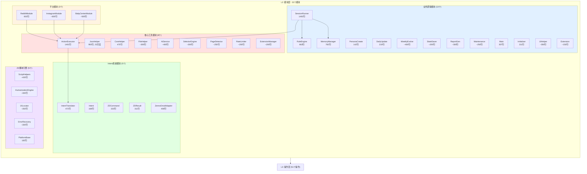
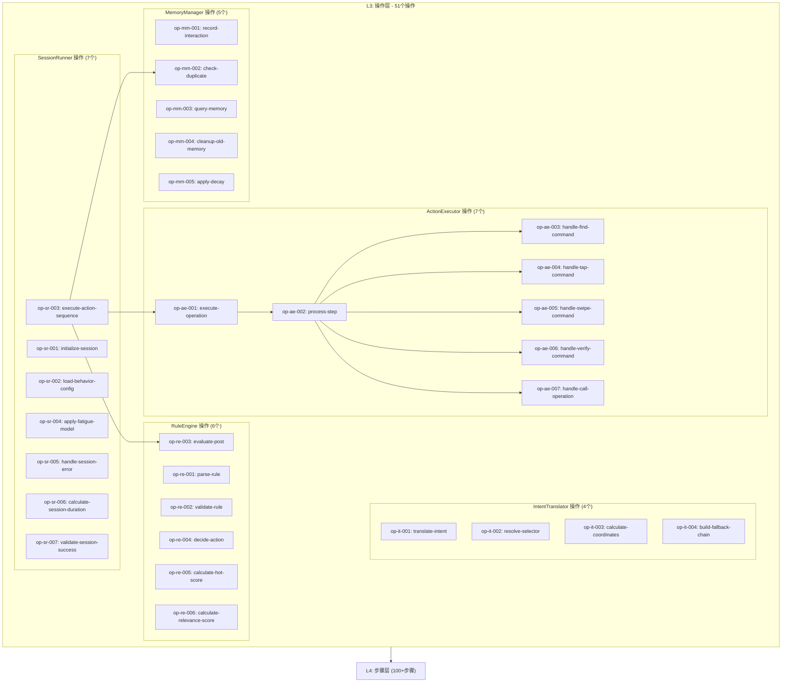
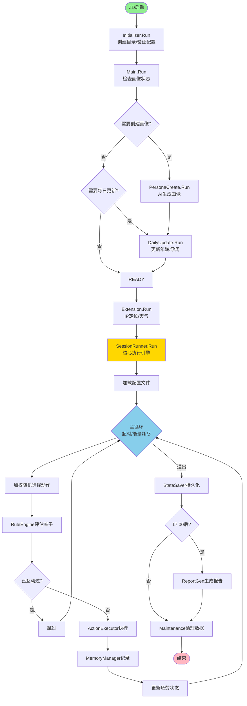
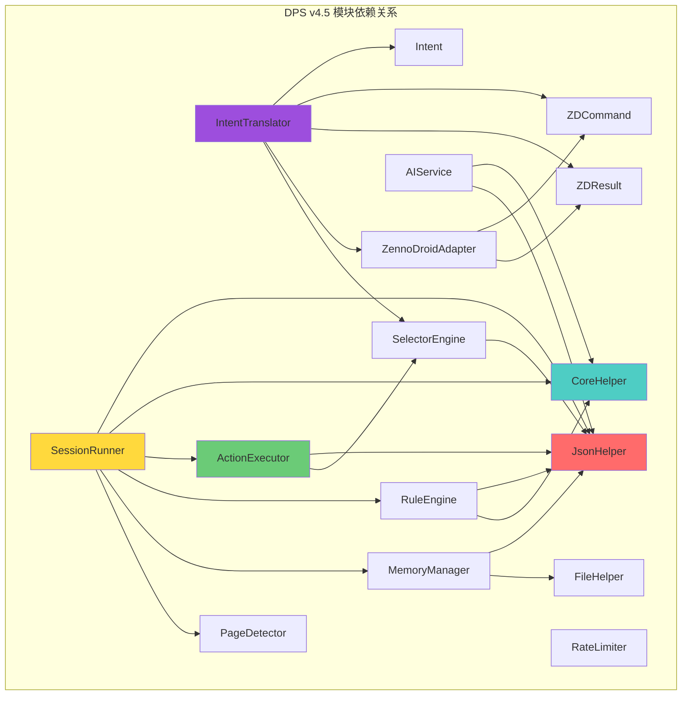
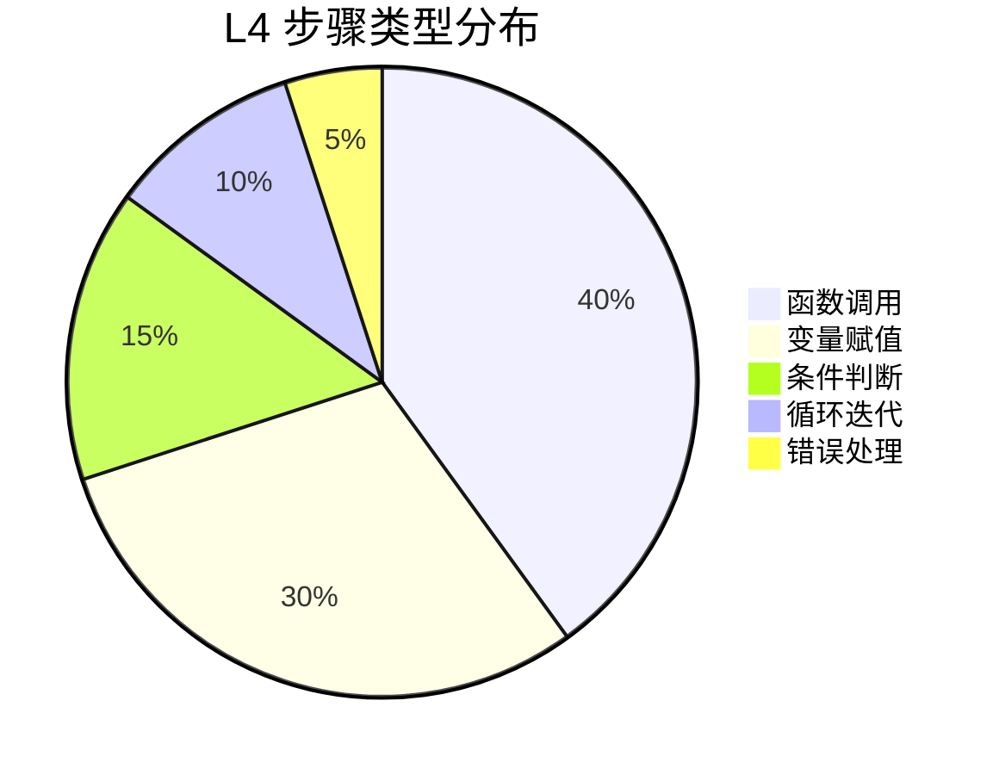

# DPS v4.5 项目架构结构图

本文档提供 DPS v4.5 项目的完整 L1-L4 层级结构图。

## 1. L1 项目级概览图

```mermaid
graph TB
    subgraph L1["L1: 项目层 - DPS v4.5"]
        A[项目元数据]
        B[架构信息]
        C[支持的平台]
        D[目录结构]
        E[项目级操作]

        A --> A1[名称: DPS v4.5]
        A --> A2[类型: C#自动化框架]
        A --> A3[版本: 4.5.8]
        A --> A4[总文件: 77, 总行数: ~24100]

        B --> B1[模式: Intent-Based Execution]
        B --> B2[DPS: 感知/记忆/决策]
        B --> B3[ZennoDroid: 定位/执行/异常]

        C --> C1[Reddit ✅]
        C --> C2[Instagram ✅]
        C --> C3[BabyCenter ✅]
        C --> C4[TikTok ⏳]
        C --> C5[Facebook ⏳]

        D --> D1[.omo/]
        D --> D2[Config/]
        D --> D3[Core/]
        D --> D4[Modules/]
        D --> D5[Platforms/]
        D --> D6[ZDProjects/]

        E --> E1[op-l1-001: 全局架构升级]
        E --> E2[op-l1-002: 性能全面优化]
        E --> E3[op-l1-003: 接入新平台]

        L1 --> L2["L2: 模块层 (32个模块)"]
    end

    style L1 fill:#e1f5ff
    style L2 fill:#fff4e1
```

## 2. L2 模块层分类图



## 3. L3 操作层流程图



## 4. 主流程执行图



## 5. 模块依赖关系图



## 6. L4 步骤类型分布



## 7. 层级关系总结

| 层级 | 名称 | 数量 | 粒度 | 示例 |
|------|------|------|------|------|
| **L1** | 项目层 | 1 个项目 | 整体 | DPS v4.5 项目 |
| **L2** | 模块层 | 32 个模块 | 功能模块 | SessionRunner, JsonHelper |
| **L3** | 操作层 | 51 个操作 | 业务操作 | execute-action-sequence |
| **L4** | 步骤层 | 100+ 步骤 | 代码语句 | create-droid-instance |

---

**生成日期**: 2026-02-28
**.omo 版本**: 2.0
**项目版本**: DPS v4.5.8
