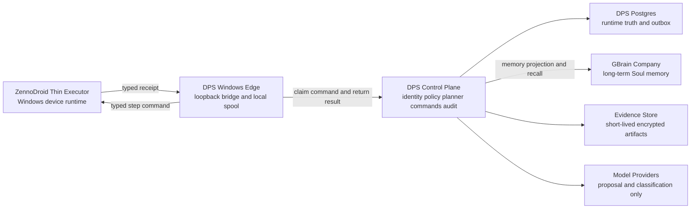

# DPS Target Architecture 目标架构

状态: Proposed  
日期: 2026-07-13  
目标: 每部手机拥有稳定 Soul ID, 由 GBrain Company 保存长期人格, 兴趣和记忆, ZennoDroid 只承担可靠执行.

## 一句话设计

`Server-owned Soul, event-sourced runtime, GBrain-backed memory, ZennoDroid execution only.`

系统分为三个真相边界:

1. DPS Control Plane 是身份, 命令, 审批, 幂等和执行审计的真相源.
2. GBrain Company 是每个 Soul 长期 Persona, Interests 和可检索记忆的持久服务与投影存储; DPS 的版本账本和 append-only event ledger 仍是可重放事实的权威来源.
3. ZennoDroid 是贴近设备的确定性执行器, 不保存长期灵魂, 不直接调用 GBrain.

## 为什么要分开

GBrain 擅长 page, graph, embedding, search 和长期知识. 它不适合承担手机执行到第几步, 点赞是否已提交, 命令租约是否过期等实时事务状态.

ZennoDroid 擅长读取 UI, 定位元素和执行 Touch, Swipe, Type, Back. 它不适合保存长期 Persona, 运行 OAuth, 承担复杂 AI 决策或每轮动态编译整个业务系统.

Control Plane 把两者连接起来, 并保证网络失败, 重复投递或进程崩溃不会变成重复评论或跨手机串记忆.

## 进程边界



第一阶段不要拆成很多微服务. Control Plane 先做成一个 modular monolith, 内部模块边界清晰, 等真实负载证明需要后再拆服务.

DPS AI Factory 是独立的升级平面, 不在手机运行链内. 它负责绑定指令, 分析影响, 建立候选制品, 汇集证据, 生成 Release BOM, 灰度和回滚准备. Factory 与 Product Control Plane 使用不同进程, 数据权限和凭证; AI 不能持有生产秘密或自我批准高风险发布.

## 模块目录与状态真相

所有注册模块使用同一目录约定, 不再同时维护 `apps/`, `services/` 或其他平行模块根. 逻辑 canonical notation 是 `modules/<module-id>`, 但迁移期的真实物理根使用 `Modules/`, 因为 legacy `Modules/` 已存在且目标 macOS/Windows 文件系统大小写不敏感:

```text
Modules/<module-id>/
├── AGENTS.md
├── module.yaml
├── src/
├── contracts/
│   ├── provided/
│   └── consumed/
├── tests/
├── migrations/
├── operations/
└── CHANGELOG.md
```

硬规则:

- `<module-id>` 是稳定的 lowercase kebab-case ID.
- 不得尝试同时创建 `Modules/` 和 `modules/`. Legacy 退休后, case-only normalization 必须作为不含行为变化的独立变更.
- 每个模块根恰好一个 `AGENTS.md` 和一个 `module.yaml`; 模块内禁止嵌套额外 `AGENTS.md`.
- Manifest 是路径所有权, 依赖, contract, permission, test, compatibility, rollout 和 rollback 的机器真相.
- 每个路径只能有一个 owner, 每个 public contract 只能有一个 owner.
- 现有 `Core/`, loose `Modules/*.cs`, `Modules/Core/`, legacy non-module directories, `ZDProjects/`, `Extensions/` 和相应配置测试在迁移期由 `legacy-runtime-adapter` 临时声明所有权. 这些文件原地保留并保持字节不变, 能力迁出后再逐项缩小 ownership.
- 目录或文档存在不代表 implemented. 模块只有在源码, contract, required tests 和对应 evidence 全部存在时才能提高状态.
- 强依赖模块由 dependency DAG, compatibility matrix 和 Release BOM 控制发布顺序, 不假装完全独立.

首批治理注册范围是 `legacy-runtime-adapter`, `soul-registry`, `memory-event-ledger`, `interest-reducer`, `gbrain-projector` 和 `evidence-service`. 除 legacy adapter 的已有运行所有权外, 新模块在可执行纵向切片通过前均为 proposed.

## 技术基线

- Control Plane: 当前受支持的 .NET LTS, 新项目建议使用 .NET 10 LTS.
- Windows Edge: .NET 10 LTS Windows Service, 绑定 `127.0.0.1`.
- ZennoDroid bridge: 先用极薄 Shared Code, 通过能力试验后再决定是否使用预编译 DLL.
- Runtime database: PostgreSQL.
- Local offline spool: SQLite with WAL, encryption, and transactional outbox.
- Long-term memory: 现有 GBrain Company Postgres 部署.
- Contracts: versioned JSON Schema and OpenAPI.
- Observability: structured logs, metrics, traces, and immutable audit events.

2026-07-13 的研究记录曾观察到 GBrain `0.42.42.0`, engine `postgres`; 这不是本工作区的当前可签发运行证据. F7 必须在目标 Company Brain 重新探测版本, Source ID 限制, OAuth 和删除语义.

## 身份模型

现有手工 `device_001` 不能作为灵魂身份. 建立以下不可混淆的标识:

```text
tenant_id
soul_id
device_binding_id
device_installation_id
platform_account_id
executor_instance_id
```

当前 proposed v1 合同将 `soul_id` 固定为 `soul_` 加 64 位小写十六进制值. 它是服务端生成的 opaque 标识, 不携带邮箱, 手机号, 平台账号或设备语义. 受 GBrain 原生 Source ID 最长 32 字符的限制, `gbrain.projection/v1` 使用 `dps-` 加 Soul 摘要后缀的前 28 位小写十六进制值, 即 112 位确定性 Source 别名. 这仍是候选接口约束，不能把离线 DTO 当作真实绑定.

`gbrain.projection/v1` 与 `soul.memory.readback/v1` 共用这个 `dps-<28-hex>` Source ID, 以及 64 位小写 SHA-256 `projection_revision` 和 `projection_checksum`. Source ID 只是截断路由键，不是 Soul 身份真相；实连适配器必须在不可变 Source 元数据、OAuth 绑定、写后读回和 Search 结果中重新校验完整 `soul_id`、revision 和 checksum. 两个 Soul 如果共享同一个 112 位前缀，必须隔离并失败关闭，不得仅凭 Source 前缀通过. F7 还要用真实写入、精确读回和 Search 原始字节证明实际 Source 隔离.

硬规则:

- `soul_id` 不等于手机序列号, ADB ID, 用户名或 OAuth client ID.
- 服务端从已认证的 device binding 推导 Soul, 不信任请求体自行声明的 Soul.
- 手机更换时创建新 binding, 原 Soul 记忆不变.
- 同一平台账号在同一时刻只能有一个有效执行租约.
- 账号切换必须创建或明确迁移 account binding, 不自动继承旧账号上下文.

## 数据所有权

| 数据 | 权威位置 | GBrain 是否保存 |
|---|---|---|
| Soul 和设备绑定 | DPS Control Plane | 仅保存去标识摘要 |
| Persona | DPS version ledger and GBrain projection | 保存 current 和版本 |
| Interests | DPS event-derived state and GBrain projection | 保存 current, evidence 和版本 |
| Seen and spoken events | DPS append-only event ledger | 保存可检索投影和摘要 |
| Command, lease, approval, result | DPS Postgres | 不保存为控制真相 |
| Screenshot and UI XML | 短期 Evidence Store | 只保存 hash 和引用 |
| Cookie, token, password, API key | Secret Store | 永不保存 |

这里的双存储不是重复真相:

- DPS ledger 保存事务和可重放事实.
- GBrain 保存长期语义记忆和检索视图.
- GBrain 投影丢失时可从 ledger 重建.

## GBrain Company 分区

安全优先的默认方案是每个 Soul 一个 GBrain source:

```text
source_id: <source-id-from-the-F7-verified-binding-contract>
federated_read: <same-source-id>,dps-shared
```

每个 source 使用独立的 source-scoped OAuth client. 该 client 只存在于 Memory Gateway 的 secret store. ZennoDroid, Windows Edge 和模型都不拿 GBrain credential.

这样选择是因为 GBrain 的数据库级隔离边界是 source. 同一个 source 内使用 slug 前缀只是命名约定, 不是权限隔离, semantic search 也可能召回其他 Soul 的内容.

若未来设备量使 per-Soul source 或 client 管理出现扩展瓶颈, 必须先完成容量和越权压测, 再评估 cohort source 加 Retrieval Broker. 不能为了省管理成本降低隔离.

## Soul 记忆模型

### Persona

Persona 保存长期稳定并获得授权的内容:

- 语言和表达风格.
- 明确喜好和不喜欢的主题.
- 行为边界和风险偏好.
- 社交边界和允许的互动类型.
- 经批准的身份叙述.

Persona 不允许 LLM 直接覆写. 修改流程固定为:

```text
evidence -> proposal -> review -> approved event -> new revision
```

### Interests

Interest 是可解释的动态状态, 不是写死在 Persona 里的词表. 每个 topic 包含:

```json
{
  "topic_id": "topic_baking",
  "weight": 0.72,
  "confidence": 0.81,
  "positive_signals": 12,
  "negative_signals": 2,
  "last_signal_at": "2026-07-13T08:00:00Z",
  "half_life_days": 30,
  "explicit": false,
  "evidence_event_ids": ["evt_1", "evt_2"]
}
```

显式兴趣直到用户撤销才变化. 推断兴趣必须有 evidence, confidence 和 decay.

### Episodic events

事件采用 append-only, 每个 event 有稳定 ID. 目标事件分类包括:

- `content.observed`
- `speech.drafted`
- `speech.approved`
- `speech.published`
- `speech.failed`
- `interest.signal.recorded`
- `persona.change.proposed`
- `persona.change.approved`
- `session.started`
- `session.completed`
- `action.result`

`seen` 只有在内容被识别并达到 dwell threshold 后成立. 滚动经过不算 seen.

`spoken` 只有在 UI 或官方 API 验证发送成功后成立. 草稿或失败文本不能写成 spoken.

当前可执行的 `memory.event/v1` 只支持经验证的 `content.observed`; 其他类型必须以新合同和测试增量引入. 下面是与当前 JSON Schema 一致的最小示例:

```json
{
  "schema_version": "1.0.0",
  "contract_id": "memory.event/v1",
  "producer_module": "memory-event-ledger",
  "event_id": "11111111-1111-4111-8111-111111111111",
  "soul_id": "soul_aaaaaaaaaaaaaaaaaaaaaaaaaaaaaaaaaaaaaaaaaaaaaaaaaaaaaaaaaaaaaaaa",
  "device_binding_id": "db_bbbbbbbbbbbbbbbbbbbbbbbbbbbbbbbb",
  "platform_account_id": "pa_cccccccccccccccccccccccccccccccc",
  "trace_id": "trace_dddddddddddddddddddddddddddddddd",
  "occurred_at": "2026-07-13T08:12:03Z",
  "idempotency_key": "idem_eeeeeeeeeeeeeeeeeeeeeeeeeeeeeeeeeeeeeeeeeeeeeeeeeeeeeeeeeeeeeeee",
  "privacy_class": "personal",
  "event_type": "content.observed",
  "observation": {
    "content_digest": "bbbbbbbbbbbbbbbbbbbbbbbbbbbbbbbbbbbbbbbbbbbbbbbbbbbbbbbbbbbbbbbb",
    "verified": true,
    "interest_signals": [
      {"topic": "photography", "confidence": 0.75}
    ]
  }
}
```

## GBrain page layout

每个 Soul source 使用稳定 slug. 建议首期只把高价值事件和聚合结果投影到 GBrain, 不为每个 Tap 或 Swipe 建 page.

```text
profile/persona/current
profile/persona/versions/<revision>
profile/interests/current
profile/interests/versions/<revision>
events/seen/<year>/<month>/<event-id>
events/spoken/<year>/<month>/<event-id>
summaries/sessions/<session-id>
summaries/daily/<yyyy-mm-dd>
summaries/weekly/<yyyy>-w<week>
projection/health
```

写入必须经过 transactional outbox:

1. Control Plane 在一个 transaction 内保存 event 和 outbox row.
2. GBrain Projector 使用 event ID 生成 deterministic slug.
3. 重试更新同一 slug, 不创建重复事件.
4. 写后执行 exact read-back, 校验 source、64 位小写 SHA-256 `projection_revision` 和 content hash；外部平台修订只可另记为 `external_revision`，不得替代逻辑修订.
5. health 或 queued 不能代表写入成功.
6. search 结果再次校验 source, Soul, schema, provenance 和 freshness.

Persona current 和 Interests current 使用 exact lookup, 不使用语义相似度决定当前事实. Search 只用于历史回忆和相关事件发现.

## Product Control Plane 目标模块

下表是目标边界, 不是当前完成清单. 真实状态由各模块 Manifest 和 evidence 决定.

| Module ID | 职责 |
|---|---|
| `control-plane-host` | Modular monolith composition root and public host |
| `soul-registry` | Soul 创建, enrollment, revoke and alias resolve |
| `device-registry` | Device installation and capability registry |
| `platform-account-registry` | Platform account identity and authorization state |
| `binding` | Soul, device and platform account bindings |
| `memory-event-ledger` | Append-only events, hash, dedup, quarantine and outbox |
| `persona-store` | Persona version ledger and approval |
| `interest-reducer` | 从事件确定性计算兴趣状态 |
| `soul-memory-adapter` | Exact state and scoped GBrain recall abstraction |
| `gbrain-projector` | Projection DTO, outbox, retry, read-back, DLQ and rebuild |
| `planner` | 根据 Soul context 生成无权限的操作提案 |
| `policy-approval` | 平台政策, rate limit, risk, approval and kill switch |
| `operation-compiler` | 把 approved operation 编译为 typed steps |
| `command-orchestrator` | Queue, lease, fencing, expiry, retry and recovery |
| `executor-gateway` | Device enrollment, heartbeat, claim and verified receipt |
| `evidence-service` | Short-lived evidence, hash and retention |
| `audit-metrics` | Trace, immutable audit, projection lag and fleet health |
| `legacy-runtime-adapter` | Transitional ownership and compatibility forwarding only |

Windows execution uses separate target modules `windows-edge-supervisor`, `windows-edge-worker`, `edge-local-journal` and `zenno-bridge`. Factory capabilities use `factory-*` modules under the same logical module root and the current physical `Modules/<module-id>/` root.

## ZennoDroid 最小职责

ZennoDroid 只保留:

- 连接 DroidInstance.
- Observe, Locate, Tap, LongTap, Swipe, Type, Back, Wait, Capture, Verify.
- 将原生绿色和红色分支统一转换成 typed receipt.
- 执行 deadline, stale lease 和 kill switch 检查.
- 网络中断时保存少量加密 result spool.

禁止:

- 任意远程 C# 或 shell 脚本.
- 在 ZennoDroid 内生成 Persona 或评论.
- 直接查询或写 GBrain.
- 未知 step 自动降级为坐标点击.
- 仅凭无异常就返回业务成功.

推荐块拓扑:

```text
Start
-> Bootstrap
-> Edge Health
-> Claim Command
-> Contract Guard
-> Switch Step Type
-> Native Action
-> Result Capture
-> Postcondition Verify
-> Receipt and Next
-> Finalize
```

所有 native branch 的绿色和红色出口都进入 Result Capture. 红色出口不能直接重试. Mutation 结果为 unknown 时先验证平台状态, 不能盲目重放.

## F0-F9 迁移路线

每一阶段只在自己的退出门有原始证据后前进. 后一阶段的模拟结果不能替代前一阶段缺失的真实环境证明.

| 阶段 | 可交付结果 | 证据上限 |
|---|---|---|
| F0 | 治理重置, truthful README, legacy byte preservation | `REPOSITORY_STATIC_VERIFIED` |
| F1 | Module Manifest, AGENTS binding, dependency and contract gates, false-green removal | `CONTRACT_VERIFIED` only when executable gates pass |
| F2 | Soul resolve to event, interest and offline GBrain projection DTO vertical slice | `INTEGRATION_VERIFIED` |
| F3 | Independent AI Factory with separated roles and recoverable external state | `INTEGRATION_VERIFIED` |
| F4 | Signed artifacts, SBOM, compatibility matrix, Release BOM and 200-device simulator | `INTEGRATION_VERIFIED` |
| F5 | SessionRunner strangler migration and complete product module boundaries | `INTEGRATION_VERIFIED` until external gates |
| F6 | Windows Edge A/B and unchanged Zenno PID/start time | `WINDOWS_VERIFIED` |
| F7 | GBrain live read-back plus two authorized non-production phones | `DEVICE_VERIFIED` |
| F8 | 1, 3, 8, 15, 30 device production canary | `CANARY_VERIFIED` |
| F9 | 200 managed, 100 sustained, 200 burst, 400 simulated and 72-hour soak | `SCALE_VERIFIED` |

When Windows, ZennoDroid, GBrain credentials, authorized accounts or fixture phones are unavailable, F6-F9 remain waiting for external evidence. Mock or simulation is useful preparation but cannot advance these verification levels.

## 必须通过的验收

- 两个 Soul 互相检索不到对方 Persona 和 memory.
- 同一天多次 session 不覆盖历史.
- 重复 result 不创建重复 event.
- 失败的草稿不会成为 spoken memory.
- GBrain 离线时 runtime event 不丢失, 恢复后自动补投.
- ZennoDroid crash 后 mutation 不被盲目重放.
- OAuth client 只能写自己的 Soul source.
- 每个 command 可以追到 receipt, event 和 GBrain page.
- 删除 Soul 后 page, chunks, embeddings, cache and backup purge 都有证据.
- 只有 Windows ZennoDroid 真机门通过的版本才能标记 `DEVICE_VERIFIED`.

## 外部依据

- GBrain Company Brain and source-scoped OAuth: https://github.com/garrytan/gbrain/blob/master/docs/tutorials/company-brain.md
- GBrain remote MCP deployment: https://github.com/garrytan/gbrain/blob/master/docs/mcp/DEPLOY.md
- ZennoDroid Shared Code: https://docs.zennolab.com/en/zennodroid/project-editor/custom-code/Directives_Using
- ZennoDroid system requirements: https://docs.zennolab.com/en/zennodroid/Installation/SysReq
- .NET support policy: https://dotnet.microsoft.com/en-us/platform/support/policy
