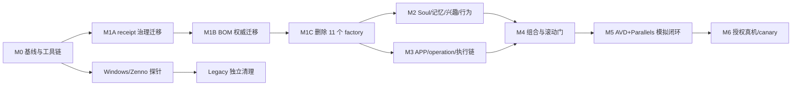

# DPS 2.0 重构计划书 v4

> 状态: `Proposed`  
> 基线: `458f9bd41290`  
> 日期: 2026-07-17  
> 当前正式证据等级: `NONE`  
> 文档性质: 持久的目标设计、迁移顺序与验收合同；不是运行状态、批准记录或进度账本

本计划由多角色、相互独立的架构、Soul/认知、Legacy/执行、安全、可靠性/统计和总审查角色对 v2 计划进行对抗性复核后重写。v4 在 v3 基础上按三轮交叉审核的确认项修订：对 v2 的多智能体交叉审核报告中仍适用于 v3 的残留项、对 v3 的异构模型终审（零 blocker，未引入修改）、以及对 v3 本体的补充完备性批判；方向与边界不变。它取代此前重构/升级计划作为最新提案，但在用户接受、合同落地、门禁通过和独立批准前，不改变 `AGENTS.md`、模块 Manifest、公共合同、运行状态或验证等级。

## 1. 执行摘要

### 1.1 最终方向

1. 保留 DPS Control Plane、GBrain Company、ZennoDroid 三层边界。
2. 删除全部 11 个 `factory-*` 模块，不再建设仓内自主升级工厂。
3. 外部 Codex/Claude 会话按模块读规则、改代码、跑门禁；普通 Git、受保护 CI、版本合同和独立审批负责约束升级。
4. 保留并接通一条唯一的“意图 -> 授权 -> 编译 -> 租约 -> 执行 -> 原生结果 -> 业务后置条件 -> 审计”链。
5. Persona、兴趣、长期记忆和行为均按 `soul_id` 隔离；两个 Soul 必须在内容偏好、记忆检索和节奏分布上可重复地区分，但 ZennoDroid 只执行显式、已授权参数。
6. 新 APP 通过一个版本化 APP 包接入；自动探索只产生隔离候选，不能直接污染运行配置。
7. 视觉 AI 只在确定性恢复失败后提供诊断或动作提案，不能直接驱动设备，也不能把失败翻成成功。
8. 会话成功率与命令可靠性使用两套独立滚动门：最近至少 300 个 eligible session 和最近至少 300 个 admitted command 都要求点估计 `>= 99%`；正式可靠性声明另需统计下界门。

### 1.2 v2 计划的阻断性纠正

| 编号 | v2 问题 | v3 裁决 |
|---|---|---|
| D-01 | 文档自称 `Current` 并把代码存在当成已验证 | 降为 `Proposed`；当前正式证据为 `NONE` |
| D-02 | 新造 `EMULATOR_VERIFIED` | 删除；AVD/Parallels 只作为 `SIMULATION` 环境元数据 |
| D-03 | 删除 factory 后 23 个保留模块仍指向 resolver | 先独立迁移 Manifest/receipt 规则，再删目录 |
| D-04 | candidate/active Release BOM 权威被先删后补 | 删除前迁出普通 CI 校验能力，并由 Control Plane 持有 active binding |
| D-05 | 治理变更在同一批次修改并批准自己的门禁 | 固定前序验证器，新旧门双跑；治理、删除、证据、批准分批 |
| D-06 | “翻锁即接通 ActionExecutor” | 取消全局解锁；先建设唯一授权入口，旧本地决策永久 fail closed |
| D-07 | Persona v2 混入兴趣和决策权重 | Persona v1 保持稳定；兴趣归 reducer，决策归 planner/policy |
| D-08 | 记忆淡忘等同于隐私删除 | 认知衰减与纠正/删除是两条独立链，均需可执行测试 |
| D-09 | 模型可审批、签名或替代人类 release authority | 模型只有 advisory/veto 权，无密钥、无批准权、无清除权 |
| D-10 | tracked `KILL_SWITCH`/通知文件充当运行状态 | 改为 Control Plane/受保护 CI 外部状态和持久通知 outbox |
| D-11 | legacy 死码先删，Windows 探针后补 | 所有受保护 Legacy 物理删除推迟到目标 ZennoDroid 探针之后 |
| D-12 | 删除 F8/F9 及非 IG 夹具 | 保留 F8/F9 证据基础设施；保留至少两个非 IG 通用回归夹具 |

## 2. 当前事实与边界

### 2.1 基线事实

- 基线包含 34 个模块目录，其中 11 个为 `factory-*`，删除后保留 23 个现有产品/治理模块。
- 11 个 factory 目录在该基线约含 50,046 行文件，其中 C#/Python 约 42,082 行；删除它们是第一笔确定的代码净减量。
- 33 个模块是 `proposed`，1 个 Legacy 模块是 `transitional`，34 个全部 `releaseEligible=false`。
- 当前 `ActionExecutor` 对空步骤、未知步骤和部分异常存在失败开放语义；现代 operation/bridge v1 又不能完整表达现有 operation 集与曲线滑动。
- 当前 MemoryEvent/GBrain 投影主要保存摘要和校验信息，尚不能证明长期记忆正文可写、可检索、可纠正、可删除且不跨 Soul。
- 当前正式仓库证据为 `NONE`。本次审查只确认静态事实，不签发 `REPOSITORY_STATIC_VERIFIED`。

### 2.2 三个权威边界

| 边界 | 拥有 | 明确不拥有 |
|---|---|---|
| DPS Control Plane | 身份绑定、Persona 真相、MemoryEvent 真相、兴趣算法、策略、审批、命令、租约、Release binding、审计、成功事实、Kill switch | GBrain 管理凭证在边缘的分发、Zenno 原生动作实现 |
| GBrain Company | 每个 Soul 的长期 Persona、兴趣和可检索记忆的语义投影及长期存储 | 命令租约、幂等、授权、速率预算、设备成功事实 |
| ZennoDroid | 已授权、版本已知、参数完整的设备动作及原生结果 | Persona、兴趣、长期记忆、模型选择、策略和审批 |

GBrain 不是普通文件仓库，也不是运行真相。DPS ledger/store 是权威源，GBrain 是经 `SoulMemory` 适配器写入并精确读回的长期语义投影。

### 2.3 非目标

- 不建设自主 AI Factory、仓内任务状态目录、代理专用 gate 状态或自定义升级控制平面。
- 不允许模型持发布私钥、平台凭证、GBrain 管理凭证或生产审批能力。
- 不做检测规避、假互动、垃圾行为、账号冒充或未授权抓取。
- 不在没有目标 Windows/ZennoDroid 探针时改写、格式化或批量删除受保护 Legacy C#。
- 不以 AVD、mock、模拟器或测试目录的存在冒充 Windows、真机或 CANARY 证据。

## 3. 四条硬要求的落地

### 3.1 按 Soul 拟人化

每个运行事实都绑定完整作用域：

```text
soul_id + device_binding_id + platform_account_id + command_id + trace_id
```

同一 Soul 换绑时，长期记忆归属仍跟随 `soul_id`；旧 device/account 只作为事件发生时的绑定证明。新绑定必须经过 binding 权威，旧绑定撤销后不能继续写入。

两个 Soul 的差异来自：

- Persona v1 中稳定、受控的性格特征；
- `interest.snapshot/v2` 中随经历强化和衰减的动态兴趣；
- Soul 专属的长期记忆检索结果；
- planner 根据上述输入生成的阅读节奏、停留区间、内容选择和表达风格；
- 每个会话重新采样、但受 Soul 分布约束的执行参数。

差异不得来自可重复的裸 `soul_id` 随机种子、边缘共享静态状态、故意误触或平台规避指纹。

### 3.2 足够精简

立即删除范围只包括 11 个 `factory-*` 模块及其专属引用、测试和文档。以下内容保留：

- 普通 Phase 0/candidate 校验能力、Release BOM 内容校验和固定攻击语料；
- active Release binding、签名验证、回滚和撤销语义；
- F8/F9 canary/scale 证据合同与验证基础设施，当前保持 dormant；
- BabyCenter、Reddit 等非 IG 通用契约/回归夹具；
- Windows 探针前无法证明安全删除的 Legacy 文件。

每个后续删除候选必须同时具备：代码图零生产调用、文本/反射/CodeDom/OwnCode 入口盘点、配置加载盘点、替代路径测试、目标 Windows 编译/加载证据和独立批准。

### 3.3 模块可单独升级、可并行开发

“单独升级”定义为模块具有独立 owner、版本、合同、测试、feature flag、canary 和 rollback，不等同于每个 modular-monolith 模块都能独立部署。

- out-of-process 模块可独立部署，但必须绑定新的 Release BOM。
- modular-monolith 模块可独立开发、测试、版本化和回滚功能，最终随 monolith BOM 原子发布。
- `legacy-runtime-adapter` 在 Windows 探针和单一 Shared Code/bridge assembly 落地前仍是一个原子升级单元。
- 公共合同采用 additive major 并存、逐消费者迁移、双读/影子比对；旧 major 仅在所有消费者和 rollback 窗口关闭后删除。
- 多个 AI 会话可在互不重叠模块上并行工作；合入由外部 merge queue 串行化，并在 merge HEAD 重跑受影响模块及全部传递消费者。
- impact scope 只能由版本化 DAG 扩大，候选会话不能手工缩小。

### 3.4 回归最初设计初衷

唯一目标链为：

```text
Intent
  -> Planner proposal
  -> deterministic policy + platform authorization + approval/promotion
  -> versioned operation.compiled contract
  -> command lease/fencing/idempotency
  -> executor gateway
  -> Windows worker/supervisor
  -> Zenno bridge
  -> one C#5 ActionExecutor
  -> native result
  -> business postcondition
  -> receipt/audit/reliability snapshot/GBrain projection
```

旧 `SessionRunner.Run`、`DecideNextAction`、`sr_use_legacy_run` 和其他边缘本地决策路径保持 fail closed。不得用“翻转总锁”代替接线。

brain-to-hand 的唯一交接合同采用 `edge.bridge.exchange/v2`：由 `zenno-bridge` 提供、`legacy-runtime-adapter` 消费。Legacy 新增一个与 `SessionRunner.Run` 完全分离的薄 C#5 入口，只接受已签名、完整身份作用域、已绑定 `operation.compiled/v2` revision 的封闭 primitive 列表；旧 Run gate 不得复用为新入口。薄入口的落位是显式决策项：默认置于 Legacy 字节基线作用域之外（如 `legacy-runtime-adapter` 模块内）；仅当探针证明 ZennoDroid 加载入口无法引用作用域外文件时，才按 §11 的 anchor 程序把它纳入受保护清单，不得静默改动 79 文件字节基线。

首个 handoff allowlist 只包含确定性 device primitives。`random_pick`、`foreach`、`if_exists`、`call_operation`、`set_var` 必须在现代 compiler 展开、求值或拒绝，不能跨 handoff 进入边缘决策。合同测试必须证明旧入口不可达、未知 primitive/版本失败关闭、完整 scope 与签名缺一即拒绝。

## 4. R0: 先修治理根，再删除 Factory

### 4.1 R0-A 基线复现

1. 在干净、可丢弃 checkout 安装仓库固定的 Python、Node、.NET、PostgreSQL 和依赖版本。
2. 记录 HEAD、工具链、Manifest、合同图、生成快照和工作区摘要。
3. 先让保留模块侧的 Phase 0/governance 基线可复现；已有红项不得与 factory 删除混为一批。
4. required check 只有 `PASS` 才算通过；`SKIP/PARTIAL/NOT_RUN/INFRA_ERROR/NOT_APPLICABLE` 均阻断。
5. 在合入第一个实现 PR（§16）前，目标仓库保护规则先行生效：main 禁直推/强推，required checks 绑定第 4 条门禁语义，启用 merge queue（平台不可用时，以 required up-to-date 加串行合入提供 §3.3 的 merge-HEAD 同等语义作为过渡）；所有权见 §15 条目 1，配置结果作为 M0 证据记录。

### 4.2 R0-B 指令 receipt 迁移

当前所有模块 Manifest 的 `agents.resolver` 都指向 `factory-instruction-resolver`。目标不是换一个同名工厂，而是：

1. 由 `Tools/ci` 中无网络、无模型、无运行状态的确定性校验器直接计算根/模块指令、Manifest、合同和测试清单的哈希 receipt。
2. 保留 `receiptRequired=true`，从 Manifest schema 和全部 34 个 Manifest（含 11 个待删 factory Manifest）删除冗余 `resolver` 字段及 factory const；schema 的 `agents` 块为 `additionalProperties: false` 且门禁校验全部注册模块，漏改任一 Manifest 都会使本批次门禁失败。其中 `legacy-runtime-adapter` 的 module.yaml 受 §11 的 Legacy 基线 anchor 保护，本批次需按 §11 同步重签。
3. 固定旧验证器和攻击语料，对旧/新 receipt 规则双跑；治理迁移由独立审查批准，不能在同一次运行中批准自己。
4. 新规则通过后，才允许删除 resolver 模块。

### 4.3 R0-C Release BOM 权威迁移

删除 `factory-release-controller` 前必须保留两类不同能力：

- 候选校验：迁入普通 `Tools/ci`，继续验证模块/合同/DAG/兼容矩阵/hash/审批，不签名、不部署、不持运行状态。
- 运行真相：由 `control-plane-host` 提供 `active.release.binding/v1`，按 `device_binding_id` 保存 BOM digest、单调 generation、opaque token、active/previous/revoked 状态，并向 policy 与 executor 提供同一个 composition-fixed reader。

Release BOM 由仓外用户/KMS release signer 签发。模型、候选代码和 Control Plane 运行进程都不能取得签名私钥。激活、撤销、回滚分别产生版本化 receipt。

### 4.4 R0-D 删除 11 个模块

独立删除批次只删除：

```text
factory-artifact-builder
factory-control-plane-host
factory-evidence-ledger
factory-impact-analyzer
factory-instruction-resolver
factory-merge-controller
factory-release-controller
factory-rollback-controller
factory-trusted-runner
factory-upgrade-intake
factory-worktree-manager
```

同步清除 catalog、Manifest、schema、DAG、compatibility、候选测试 policy、CODEOWNERS、CI、README 和 operations 中的 factory 权威引用，但不得删除已迁出的 receipt/BOM/回滚安全能力。删除后的硬门是保留代码、配置、schema 和 23 个 Manifest 中不存在运行时 `factory-*` 依赖。

### 4.5 信任根再基线化

R0-B/R0-C/R0-D 每一批都会改写候选门禁的信任根清单 `CANDIDATE_TRUST_PATHS`（Manifest schema、Tools/ci 门禁脚本、候选测试 policy、module catalog/DAG/compatibility、CODEOWNERS、resolver 源码及其 receipt/intent schema 等）。clean 候选证据要求全部信任根与显式基线逐字节一致，且基线必须是 HEAD 的祖先而非 HEAD 本身，因此这类批次的合入提交自身取不到 clean 证据。固定程序为两段式取证：

1. 合入前以 diagnostic 工作区模式（`--diagnostic-workspace`）取记录性验证，不署名提交、不充当正式证据；
2. 批次合入为提交 D 后，在 D 的后继提交（必要时空提交）上以 `--base D` 重跑门禁，取首个 clean 候选证据作为该批次的正式静态门结果。

merge queue 对触碰信任根的批次按同一两段式取证。

## 5. Soul、记忆、兴趣和行为

### 5.1 Persona 保持 v1

`persona.revision/v1` 继续只表达稳定、闭词表的 Persona traits，不把动态兴趣、决策权重、设备参数或模型 prompt 塞入 Persona。若现有 trait vocabulary 不足，先以 additive trait vocabulary 变更和全消费者审查处理，不预设 Persona v2。

Persona store 是 DPS 权威源。新增 persona outbox -> GBrain projector -> SoulMemory adapter -> exact readback 链；写入、重放、冲突、纠正、逻辑删除和下游删除传播都必须有独立测试。

### 5.2 长期记忆合同

新增 `memory.event/v3` 与 `gbrain.projection/v3`，采用 major 并存迁移，不修改现有 v1/v2 语义。当前 `gbrain.projection/v2` 只代表 `dto-rendered-not-written` 的摘要投影，不能承载本节的长期正文和隐私生命周期。v3 至少包含：

- canonical `soul_id`；
- 事件发生时的 binding/account 证明，而不是把 Soul 永久冻结在一个设备元组；
- 来源事件、正文或受控内容引用、revision、checksum、provenance；
- retention、correction、tombstone 和 projection lifecycle；
- ledger head/sequence、总事件数、保留子集、摘要覆盖范围和校验根。

`gbrain-projector` 拥有 v3，产生 Persona current、interest current 和 memory pages；`soul-memory-adapter`、`evidence-service` 及 compatibility/DAG 从各自实际登记的消费 major 出发显式登记双读、逐消费者切换和 rollback——基线上两个消费者只登记了 v1 消费，v2 仅有 provider 侧登记与验证门要求、没有任何消费边，因此登记 v1/v3 双读，不得虚构从未存在的 v2 消费历史。adapter 执行精确写后读回、搜索结果再读回和跨 Soul 负例。

“想不起来”通过检索权重衰减实现；隐私纠正/删除通过 effective-event 视图、tombstone、GBrain 删除传播和重建实现。二者不得共用一个布尔字段，也不得用认知淡忘代替数据删除。

### 5.3 兴趣算法 v2

`interest-reducer` 拥有 `interest.seed/v1` 或等价的受验证 seed event；seed 不归 persona-store 或 soul-registry。`interest.snapshot/v1` 的 `exponential-half-life/v1` 保持不变，v2 使用新 major。

每条已验证 reinforcement 先计算时间衰减分数：

```text
S = sum(weight(kind_i) * confidence_i * exp(-ln(2) * age_i / half_life_i))
raw(S) = 1 / (1 + exp(-a * (S - b)))
interest(S) = clamp((raw(S) - raw(0)) / (1 - raw(0)), 0, 1)
```

这给出零起点、慢启动、阈值附近快速提升、平台期和随时间回落。`kind` 只能来自已批准 operation receipt 的封闭枚举；失败动作、模型猜测和不可信文本不能强化兴趣。

写码前冻结 `weight/a/b/half_life`、UTC 时基、精度、舍入、乱序策略、epsilon 复活规则和 golden vectors。测试覆盖强化、衰减、复活、重复、乱序、换绑、跨 Soul、版本回放和参数边界。

### 5.4 行为参数

planner 根据 Persona v1、interest v2、检索记忆和当前上下文生成稳定的行为分布，再用独立 session nonce/安全熵采样显式执行参数。跨会话宏观节律（活跃时段窗口、会话频次、会话时长）与动作构成比的分布同样由 planner 按 Soul 生成：会话发起作为提案进入同一 Intent -> policy 授权链，动作构成比经既有逐动作提案实现；若当前设备/样本量不足以支撑可辨性验收，须在 M2 退出条件显式标注 DEFERRED，不得留空。授权 `operation.compiled/v2` 信封绑定：

```text
soul/device/account/session/command/trace
persona_revision + interest_revision + memory_revision
operation_compiled_revision + issued_at + expires_at + nonce + signature_digest
delay/typing/trajectory parameters
```

ZennoDroid 不读取 Persona/兴趣/记忆，不自行随机化业务决定，只按包内有界参数执行。Soul 身份保留在认证信封和结构化审计中，但不进入模型文本、普通日志或可残留的全局 ZD 变量。

允许：受可靠性约束的随机延迟、点位微小抖动、贝塞尔轨迹和阅读节奏。禁止：误双击、误返回、故意失败、绕过平台检测或任何可能触发副作用的“拟人错误”。

## 6. 通用 APP 与唯一 ActionExecutor

### 6.1 一个 APP 包事实源

由现有 `operation-compiler` 模块拥有版本化 `app.package/v1` schema、canonical package 和 compiler。事实源位于：

```text
Modules/operation-compiler/app-packages/<app-id>/app.json
```

一个包包含 manifest、页面签名、selectors、operations、intents、postconditions、APP 版本兼容和风险分类。确定性 compiler 校验后生成 Legacy 所需的 `Config/**` 运行产物；生成物在过渡期继续由 `legacy-runtime-adapter` 唯一拥有，不得手工维护。现有 `Config/device_app_mapping.json` 也继续由该模块拥有，直到 binding/platform-account 合同另行迁移；它不属于 APP package。

`Tools/app_onboarder/**` 在迁移完成前仍由 `legacy-runtime-adapter` 拥有，只能在隔离工作区产生 candidate artifact；经批准的 canonical package 才由独立 PR 写入 `operation-compiler` 模块，避免跨模块运行时写入和 ownership overlap。

### 6.2 自动探索安全流

`app_onboarder` 改为：

```text
read-only explore -> isolated candidate bundle -> schema validate
-> deterministic fixture tests -> advisory review -> policy/owner approval
-> atomic promotion -> compile
```

- 默认只读，未知 action kind 失败关闭，禁止默认生成 `tap`/`submit`。
- 中途失败不得修改正式配置。
- candidate 记录 app/version、dump/screenshot hash、模型版本和 provenance，初始状态为 `DISCOVERED_UNTRUSTED`。
- 至少用两个结构不同的非 IG fixture 证明配置通用性，防止 IG 特例回流代码。

### 6.3 operation.compiled v2

现有公共合同是 `operation.compiled/v1`。由 `operation-compiler` 作为 v1/v2 provider additive 提供能表达多 step、swipe/back/scroll/long-press 及逐步后置条件的 `operation.compiled/v2`，不得另造一个同义的 `operation.package` ID。只有直接读取该 DTO 的 `command-orchestrator` 登记为 v1/v2 consumer；gateway、worker、supervisor 和 zenno-bridge 分别迁移自己拥有的下游边界合同。`legacy-runtime-adapter` 只消费 `edge.bridge.exchange/v2`，并校验其中绑定的 `operation.compiled/v2` revision/digest。所有边界共享同一 primitive 枚举与兼容矩阵，但不伪造直接依赖边。

ActionExecutor 的规则：

- 空 steps、未知 step、未知版本、异常、timeout、部分执行一律失败关闭；
- 每一步先读原生结果，再验证版本化业务后置条件；
- 只有全部 required steps 和目标后置条件通过才返回 success；
- `SwipeCurved` 只有在 Parallels/ZennoDroid 实测 Input API 签名后，才通过薄 C#5 bridge 接入；
- Legacy AIService 和边缘模型网络调用从最终编译清单移除。

## 7. 按需视觉纠错

视觉流程只允许在本地 selector/retry/postcondition 产生封闭的 recoverable error 后启动：

```text
deterministic failure
-> redacted content-addressed screenshot capability
-> modern model broker diagnostic/proposal
-> new action proposal
-> full platform authorization + policy + rate budget
-> deterministic execution + postcondition
```

模型返回诊断类别或候选动作，不能直接调用 `ExecuteRecovery`，不能修改运行配置，不能宣告成功。截图 capability 必须绑定 Soul/device/account/trace、MIME/size/hash、短 TTL 和删除策略；DM、凭证画面、GBrain 原文和第三方敏感内容不得发送。

优先在 Control Plane composition root 内以窄 `IModelBroker` 端口实现 secret handle、固定 egress allowlist、预算和轮换；只有独立凭证边界无法在该进程内证明时，才另立一个最小模块，不能为“模块化”再造一层工厂。

## 8. 99% 会话与滚动门

### 8.1 收据与分母

`control-plane-host` 在 planner/policy 前签发不可变 `session_attempt_id`，绑定请求作用域、cohort、时间和幂等键；planner 在 policy 前为每个动作提案签发不可变 `action_attempt_id`。不能等看到难度或 policy 结果后才决定是否记录 attempt。

`command-orchestrator` 以新 major 定义 receipt/eligibility 合同，`audit-metrics` 持久化、去重并计算 session 与 command 两套 snapshot，`policy-approval` 消费二者并负责阻断。

- Session 成功率分母：版本化 eligibility 规则判定为 eligible 的唯一 `session_attempt_id`。
- Command 可靠性分母：policy 已批准且 durable dispatch 已准入的唯一 `command_id`。
- Coverage/排除率分母：全部不可变 `session_attempt_id` 或 `action_attempt_id`，包括准入前被拒绝的尝试。

准入后的 `FAILED`、timeout、异常、selector stale、partial、未对账 `UNKNOWN_OUTCOME` 和 postcondition fail 全部计 command 失败。只有准入前封闭 reason 枚举中的 `POLICY_DECLINED`、用户取消和真实 `NOT_APPLICABLE` 可从对应成功率分母排除，但仍进入 coverage 分母；任一 required cohort 排除率超过 5% 即数据质量 `FAIL`。

attempt、eligibility 和 outcome append-only；重复 ID 只计一次，冲突隔离。迟到对账只追加 correction，不改变原始 attempt 时间、cohort 或窗口成员身份。

### 8.2 会话门

一个 session 必须同时满足：

- 至少一个已准入动作，且 session goal postcondition 为 `PASS`；
- 已准入动作点估计 `success / admitted >= 0.99`；
- 无未对账 UNKNOWN、关键安全失败、跨 Soul 泄漏或 kill switch；
- eligible 但空执行或全被拒绝的 session 计失败；只有由预先冻结 eligibility 规则判定的非 eligible session 才可排除并进入排除率。

### 8.3 双滚动健康门

- Session gate：每个 required session cohort 取最近 300 个 eligible session，最长覆盖 30 天；`session_goal_success / eligible_session >= 0.99`。
- Command gate：每个 required command cohort 取最近 300 个 admitted command，最长覆盖 30 天；`successful_command / admitted_command >= 0.99`。
- 任一 gate 的 `n < 300` 都是 `WARMING_UP`，不是 PASS；只允许 shadow/read-only 或预先签名、限额、可立即停止的 canary。
- 两个 gate 都达到点估计 `>= 0.99` 才是 `HEALTH_PASS`；各自 `297/300` 通过、`296/300` 失败。
- Session cohort 至少绑定 environment、app/version、Release BOM 和 behavior revision；Command cohort 还绑定 operation kind、postcondition version、selector/config hash。Soul/device 作为 guardrail，不能用长会话、全局均值或 observe/wait 成功遮住坏切片。

### 8.4 正式 99% 声明门

运行健康 PASS 不等于统计证明。对外声称“有效成功率至少 99%”还要求：

- 每个 required session cohort 最近至少 1,000 个 eligible session，单侧 95% Clopper-Pearson 下界和预注册的 device/day block-bootstrap 下界都 `>= 0.99`；
- 每个 required command cohort 最近至少 1,000 个 admitted command、覆盖至少 30 个 session，单侧 95% Clopper-Pearson 下界和 session-block bootstrap 下界都 `>= 0.99`；
- 参数、窗口和 bootstrap 规则在看结果前冻结；
- 原始 attempt、eligibility、receipt 和 correction 可从签名 artifact 独立重算。

## 9. 无人值守安全网

### 9.1 异构模型复核

每个候选 diff 至少交给两个独立、便宜的异构 reviewer，绑定同一 commit/diff/evidence hash，并输出严格 schema。任一 `FAIL`、`UNAVAILABLE`、结果分歧或 hash 不一致都冻结候选并通知用户。

模型只能输出建议或 advisory veto；确定性控制器在收到 schema-valid `FAIL`、`UNAVAILABLE`、分歧或 hash 不一致时置位冻结。模型不能直接写控制面状态，不能审批、签发 Release BOM、持私钥或清除冻结。无实时人工盯守通过“一次性预先签名的有限范围授权 + 确定性门禁 + 自动冻结”实现；超出授权范围和当前 human-required R2/R3 发布仍需用户/具名批准者批准。

### 9.2 两个停止面

- Runtime kill switch：Control Plane 持久、单调、可审计状态；policy 拒绝新批准，orchestrator 停止新租约，executor 核验栅栏。只有用户/授权控制面可清除。
- Engineering freeze：受保护 CI/merge queue 外部状态；阻止合入、签发和 promotion，不写入 Git 任务文件。

通知使用独立持久 outbox、重试、去重和 ACK。通知通道失败为 `INFRA_ERROR`，不得解除冻结。仓库不创建 `governance/KILL_SWITCH`、`ATTENTION_REQUIRED.md` 或进度账本。

### 9.3 平台授权

任何平台动作都必须经过第七项明确授权链：

```text
platform raw proof -> independent verification -> signed evidence
-> platform-account registry -> policy revalidation -> short-lived action scope
```

缺 store、signer、证据、scope、速率预算或时效均拒绝。Phase 1 的真实 APP 只编译 read-only allowlist；现有 like/comment/follow/share 等写操作不进入签名包，直到另一个里程碑取得明确平台授权和独立批准。

## 10. 里程碑与并行关系



| 里程碑 | 主要交付物 | 退出条件 |
|---|---|---|
| M0 | 干净基线、固定工具链、current/proposed/verified 清单 | 保留侧 required baseline 可复现，仓库保护规则已启用 |
| M1A | receipt schema/Manifest/validator 迁移 | 固定旧门与新门对攻击语料均 PASS，独立批准 |
| M1B | 普通 candidate BOM validator、active release binding、外部 signer 合同 | policy 与 gateway 读同一 generation/token，回滚/撤销测试 PASS |
| M1C | 11 个 factory 目录和专属引用删除 | 无悬空 owner/consumer/schema，代码净减少，完整静态门与 module-impact suite PASS；外部 merge queue（§15 条目 1）已配置并以模拟并行冲突及 merge HEAD 重跑验证 |
| M2 | Persona 投影、memory v3、interest v2、planner 行为分布与 session nonce 参数采样、Soul 隔离 | 双 Soul 正反例（含固定输入下行为分布差异）、换绑、删除传播、golden vectors PASS |
| M3 | app package、operation.compiled v2、edge handoff v2、独立 Legacy 入口、唯一 ActionExecutor、视觉提案链 | 旧入口不可达；未知/空/partial fail closed；信封 delay/typing/trajectory 参数在携带对应参数的 step 上消费生效、越界即拒绝，均有可执行测试；两种非 IG fixture 与 visual-security suite PASS |
| M4 | composition root、attempt/receipt、postcondition、session+command reliability snapshot、kill switch | 端到端 PostgreSQL + native fixture，两套 300 窗口语义与 kill-notify suite PASS |
| M5 | macOS AVD + Parallels + ZennoDroid 模拟环境 | 原始 evidence 标记 `SIMULATION`；不提升 Windows/DEVICE 等级 |
| M6 | 目标 Windows、授权设备、受限 canary | 仅由对应可执行门逐级签发既有 evidence level |

M2 与 M3 可并行开发；M1 治理迁移、公共合同 landing、Legacy 清理和最终 promotion 必须串行审阅。任何公共合同扩散都重新计算 affected consumers。M1A/M1B/M1C 均改写候选门禁信任根，其 required 静态门 PASS 按 §4.5 两段式在批次合入提交的后继提交上取证。

## 11. Legacy 探针与清理

Parallels/ZennoDroid 探针至少记录：目标 ZennoDroid 版本、.NET Framework/C# CodeDom 能力、OwnCode 实际编译清单、项目加载入口、GAC/DLL、ADB 授权、adb/PowerShell 精确版本（CapabilityProbe 断言：adb 37.0.0-14910828、pwsh 7.6.2）、Input API 签名、固定端口/超时和文件编码/hash；以及两项环境接受性：ZennoDroid Enterprise 经网络 ADB 对 AVD 的设备接受性（官方口径仅承诺真机+BlueStacks，须最早实测；失败则 M5 环境回退为 Parallels USB 直通真机，转用户决策），和 AVD 冷启动/snapshot 恢复后的 ADB 设备身份连续性（serial/ip:port/ADB 授权是否漂移）与 ZennoDroid Device Manager 重连稳定性——身份漂移即构成换绑，按 §3.1 经 binding 权威重建。ZennoDroid、supervisor/worker 与 adb server 必须共置同一 Windows 实例（双向 loopback fail closed，不得跨 VM 拆分）。

探针之前：

- 不格式化、转码或改变受保护 Legacy C# 的 BOM/行尾；
- 不删除 AppExplorer、WeeklyEvolve、ZDProjects、Extensions 或 loose `Modules/*.cs`；
- 可以在现代侧加 fail-closed adapter、测试和 feature flag，但不能声称 Legacy 已可独立升级。

探针之后的每个物理删除作为独立变更，附零入口证明、Windows 编译/加载原始结果、rollback 和独立批准。未触及 Legacy 文件保存前后 SHA-256 比对。该比对由 `legacy-runtime-adapter` 的 required 静态门强制：一个仓外只读 anchor 钉死 79 个 Legacy C# 文件的字节基线及该模块 module.yaml、验证器与其测试等保护文件；anchor 无密码学签名，其独立性来自文件与父目录归属异于验证器运行身份的 OS 账户。凡改变该字节基线或保护文件的批次——最早是 R0-B 改动该模块 module.yaml，其后 M3 的 ActionExecutor 失败关闭改造与最终编译清单变更、薄 C#5 入口若经探针证明必须落入受保护作用域、以及每个物理删除——都必须把验证器清单绑定、字节基线制品与仓外只读 anchor 的用户特权更新归入同一独立批次并独立批准。

## 12. 必需测试与证据

| Suite | 必须证明 |
|---|---|
| governance-migration | 新旧 receipt/BOM 规则、攻击语料、无自批准、无 factory 悬空引用 |
| module-impact | provider/consumer/DAG、并行变更冲突、merge HEAD 重跑、回滚 |
| soul-isolation | 两 Soul 正向差异、跨 Soul 零泄漏、残留上下文拒绝、换绑连续性 |
| memory-lifecycle | 正文/引用写入搜索读回、纠正、tombstone、删除后零命中、重建 |
| interest-v2 | 慢启动、快速提升、平台、时间衰减、复活、golden vectors |
| app-package | 候选隔离、原子 promotion、未知 action 拒绝、两种非 IG fixture |
| execution-path | 唯一授权入口、逐 step native result、业务 postcondition、未知版本失败关闭、信封行为参数逐 step 生效与越界拒绝 |
| behavior-params | 分布有界、nonce 采样不可由裸 soul_id 复现、信封绑定 persona/interest/memory revision、无副作用误触 |
| visual-security | prompt injection、截图 capability、敏感内容脱敏、模型不能直驱动作 |
| reliability | attempt/分母真值、session+command 双 300 窗口、双 1,000 样本统计门、分层、排除率、重放/崩溃窗口 |
| kill-notify | runtime kill、工程 freeze、租约停止、未授权清除请求拒绝且冻结保持、通知 outbox/ACK、失败保持冻结 |
| simulation | AVD/Parallels 环境标记与原始制品，不冒充 Windows/DEVICE |
| windows-device | 目标 ZennoDroid/ADB/真实授权设备；当前预期 `NOT_RUN` |

重复投递、dispatch 前、native 首字节后、receipt commit 后、audit append 后的崩溃窗口均为 required。一个 `command_id` 只计一次；UNKNOWN 先计失败、禁止盲重试，后续对账只追加 correction。

正式证据等级仍只有：

1. `REPOSITORY_STATIC_VERIFIED`
2. `CONTRACT_VERIFIED`
3. `INTEGRATION_VERIFIED`
4. `WINDOWS_VERIFIED`
5. `DEVICE_VERIFIED`
6. `CANARY_VERIFIED`
7. `SCALE_VERIFIED`

AVD、hosted、mock、native fixture 和真实设备必须用环境元数据区分。没有可执行 gate 和原始 artifact 时不得升级等级。

## 13. 回滚与停止条件

任何一项触发停止：

- required check 非 PASS；
- reviewer 分歧、不可用或输入 hash 不一致；
- 未知 contract/version/action/selector/policy/approval/identity；
- active BOM generation/token 在 native call 前后变化；
- Soul/device/account 作用域不一致或跨 Soul 数据命中；
- UNKNOWN 未对账、postcondition 失败、排除率超限或 required cohort 非 PASS；
- secret、PII、截图或 GBrain 原文进入 Git、日志、prompt 或错误通道；
- Legacy 编码/hash 漂移；
- kill switch/notification 无法核验。

回滚只选择 previous signed BOM、关闭 feature flag、停止新租约并保留审计/未决对账；不得删除源事件、伪造成功或把 rollback 声称为数据擦除。

## 14. Definition of Done

DPS 2.0 仅在以下事实都成立时完成：

- 11 个 factory 模块已删除，所需安全能力已迁出且无第二套工厂；
- 唯一 brain-to-hand 链已接通，旧本地决策和失败开放路径不可达；
- Persona/记忆/兴趣/行为按 Soul 隔离，两个 Soul 的差异、换绑连续性、纠正和删除有可执行证明；
- 一个 APP 包即可生成全部 Legacy 运行配置，新增 APP 不改业务代码；
- 自动探索不污染正式配置，视觉模型不直接执行或宣告成功；
- 行为参数有界、显式、可审计，随机延迟和贝塞尔滑动不引入副作用误触或规避行为；
- 会话门、session+command 双 300 滚动健康门和正式统计声明门均从原始 attempt/eligibility/receipt 独立重算；
- 模块升级具有 consumer 影响门、feature flag、canary、kill switch 和 rollback；
- 当前环境只声明实际取得的既有 evidence level，Windows、真机、canary 和 scale 未完成时明确保持未验证；
- README、Architecture、Operations、Engineering Standards 和 CHANGELOG 与最终可执行行为一致。

## 15. 用户一次性前置事项

用户不需要实时盯守每个升级会话，但需要在相应阶段一次性提供或批准：

1. 仓外 release signer/KMS 和受保护 CI/merge queue 的所有权；
2. 异构 reviewer 的凭证、预算与通知通道；
3. Parallels Windows、目标 ZennoDroid 安装介质/许可和网络 ADB 条件，以及在 AVD 上安装/登录目标 APP 的条件（Play 商店需可登录的 Google 账号，或改用 apk 旁加载）；
4. 每个真实平台账号/动作的明确授权范围和速率预算；真实平台账号在模拟器登录预期触发风控验证乃至锁定，只使用非主力账号并由用户知情承担，该账号不可用不构成 M5 退出阻塞；
5. 真实 GBrain 的 per-Soul 最小权限凭证、Voyage embedding 凭证及数据 retention/delete 规则；
6. R2/R3 human-required promotion 和首次 canary 的具名批准；
7. 以独立 OS 身份维护仓外只读 Legacy 基线 anchor：M0 基线复现即需其可用；此后任何改变 79 文件字节基线或 anchor 保护文件的批次（见 §11 枚举）均需以该独立身份重新签发落盘。

这些前置事项可以预先签成有限范围授权，但模型不能自行扩大范围、替代批准或清除停止状态。

## 16. 施工启动顺序

接受本计划后，第一个实现 PR 只做 M0/R0-A：恢复固定工具链、取得干净可比较基线、输出保留侧错误迁移表。第二个 PR 只做 receipt 治理迁移，第三个 PR 只做 BOM 权威迁移；三者独立审核后，第四个 PR 才删除 11 个 factory 模块。Soul 轨和执行轨从 M1C 后并行，不提前物理删除 Legacy。
