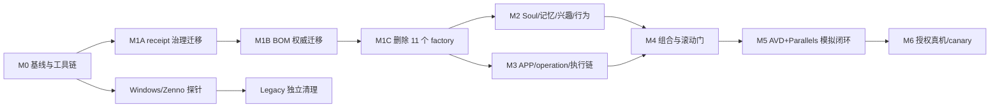

# DPS 2.0 重构计划书 v4

> 状态: `Proposed`  
> 基线: `458f9bd41290`  
> 日期: 2026-07-17  
> 当前正式证据等级: `NONE`  
> 文档性质: 持久的目标设计、迁移顺序与验收合同；不是运行状态、批准记录或进度账本

本计划由多角色、相互独立的架构、Soul/认知、Legacy/执行、安全、可靠性/统计和总审查角色对 v2 计划进行对抗性复核后重写。v4 在 v3 基础上按三轮交叉审核的确认项修订：对 v2 的多智能体交叉审核报告中仍适用于 v3 的残留项、对 v3 的异构模型终审（零 blocker，未引入修改）、以及对 v3 本体的补充完备性批判；方向与边界不变。它取代此前重构/升级计划作为最新提案，但在用户接受、合同落地、门禁通过和独立批准前，不改变 `AGENTS.md`、模块 Manifest、公共合同、运行状态或验证等级。

## 1. 执行摘要

### 1.1 最终方向

1. 保留 DPS Control Plane、GBrain Company、ZennoDroid 三层边界。
2. 删除全部 11 个 `factory-*` 模块，不再建设仓内自主升级工厂。
3. 外部 Codex/Claude 会话按模块读规则、改代码、跑门禁；普通 Git、受保护 CI、版本合同和独立审批负责约束升级。
4. 保留并接通一条唯一的“意图 -> 授权 -> 编译 -> 租约 -> 执行 -> 原生结果 -> 业务后置条件 -> 审计”链。
5. Persona、兴趣、长期记忆和行为均按 `soul_id` 隔离；两个 Soul 必须在内容偏好、记忆检索和节奏分布上可重复地区分，但 ZennoDroid 只执行显式、已授权参数。
6. 新 APP 通过一个版本化 APP 包接入；自动探索只产生隔离候选，不能直接污染运行配置。
7. 视觉 AI 只在确定性恢复失败后提供诊断或动作提案，不能直接驱动设备，也不能把失败翻成成功。
8. 会话成功率与命令可靠性使用两套独立滚动门：最近至少 300 个 eligible session 和最近至少 300 个 admitted command 都要求点估计 `>= 99%`；正式可靠性声明另需统计下界门。

### 1.2 v2 计划的阻断性纠正

| 编号 | v2 问题 | v3 裁决 |
|---|---|---|
| D-01 | 文档自称 `Current` 并把代码存在当成已验证 | 降为 `Proposed`；当前正式证据为 `NONE` |
| D-02 | 新造 `EMULATOR_VERIFIED` | 删除；AVD/Parallels 只作为 `SIMULATION` 环境元数据 |
| D-03 | 删除 factory 后 23 个保留模块仍指向 resolver | 先独立迁移 Manifest/receipt 规则，再删目录 |
| D-04 | candidate/active Release BOM 权威被先删后补 | 删除前迁出普通 CI 校验能力，并由 Control Plane 持有 active binding |
| D-05 | 治理变更在同一批次修改并批准自己的门禁 | 固定前序验证器，新旧门双跑；治理、删除、证据、批准分批 |
| D-06 | “翻锁即接通 ActionExecutor” | 取消全局解锁；先建设唯一授权入口，旧本地决策永久 fail closed |
| D-07 | Persona v2 混入兴趣和决策权重 | Persona v1 保持稳定；兴趣归 reducer，决策归 planner/policy |
| D-08 | 记忆淡忘等同于隐私删除 | 认知衰减与纠正/删除是两条独立链，均需可执行测试 |
| D-09 | 模型可审批、签名或替代人类 release authority | 模型只有 advisory/veto 权，无密钥、无批准权、无清除权 |
| D-10 | tracked `KILL_SWITCH`/通知文件充当运行状态 | 改为 Control Plane/受保护 CI 外部状态和持久通知 outbox |
| D-11 | legacy 死码先删，Windows 探针后补 | 所有受保护 Legacy 物理删除推迟到目标 ZennoDroid 探针之后 |
| D-12 | 删除 F8/F9 及非 IG 夹具 | 保留 F8/F9 证据基础设施；保留至少两个非 IG 通用回归夹具 |

## 2. 当前事实与边界

### 2.1 基线事实

- 基线包含 34 个模块目录，其中 11 个为 `factory-*`，删除后保留 23 个现有产品/治理模块。
- 11 个 factory 目录在该基线约含 50,046 行文件，其中 C#/Python 约 42,082 行；删除它们是第一笔确定的代码净减量。
- 33 个模块是 `proposed`，1 个 Legacy 模块是 `transitional`，34 个全部 `releaseEligible=false`。
- 当前 `ActionExecutor` 对空步骤、未知步骤和部分异常存在失败开放语义；现代 operation/bridge v1 又不能完整表达现有 operation 集与曲线滑动。
- 当前 MemoryEvent/GBrain 投影主要保存摘要和校验信息，尚不能证明长期记忆正文可写、可检索、可纠正、可删除且不跨 Soul。
- 当前正式仓库证据为 `NONE`。本次审查只确认静态事实，不签发 `REPOSITORY_STATIC_VERIFIED`。

### 2.2 三个权威边界

| 边界 | 拥有 | 明确不拥有 |
|---|---|---|
| DPS Control Plane | 身份绑定、Persona 真相、MemoryEvent 真相、兴趣算法、策略、审批、命令、租约、Release binding、审计、成功事实、Kill switch | GBrain 管理凭证在边缘的分发、Zenno 原生动作实现 |
| GBrain Company | 每个 Soul 的长期 Persona、兴趣和可检索记忆的语义投影及长期存储 | 命令租约、幂等、授权、速率预算、设备成功事实 |
| ZennoDroid | 已授权、版本已知、参数完整的设备动作及原生结果 | Persona、兴趣、长期记忆、模型选择、策略和审批 |

GBrain 不是普通文件仓库，也不是运行真相。DPS ledger/store 是权威源，GBrain 是经 `SoulMemory` 适配器写入并精确读回的长期语义投影。

### 2.3 非目标

- 不建设自主 AI Factory、仓内任务状态目录、代理专用 gate 状态或自定义升级控制平面。
- 不允许模型持发布私钥、平台凭证、GBrain 管理凭证或生产审批能力。
- 不做检测规避、假互动、垃圾行为、账号冒充或未授权抓取。
- 不在没有目标 Windows/ZennoDroid 探针时改写、格式化或批量删除受保护 Legacy C#。
- 不以 AVD、mock、模拟器或测试目录的存在冒充 Windows、真机或 CANARY 证据。

## 3. 四条硬要求的落地

### 3.1 按 Soul 拟人化

每个运行事实都绑定完整作用域：

```text
soul_id + device_binding_id + platform_account_id + command_id + trace_id
```

同一 Soul 换绑时，长期记忆归属仍跟随 `soul_id`；旧 device/account 只作为事件发生时的绑定证明。新绑定必须经过 binding 权威，旧绑定撤销后不能继续写入。

两个 Soul 的差异来自：

- Persona v1 中稳定、受控的性格特征；
- `interest.snapshot/v2` 中随经历强化和衰减的动态兴趣；
- Soul 专属的长期记忆检索结果；
- planner 根据上述输入生成的阅读节奏、停留区间、内容选择和表达风格；
- 每个会话重新采样、但受 Soul 分布约束的执行参数。

差异不得来自可重复的裸 `soul_id` 随机种子、边缘共享静态状态、故意误触或平台规避指纹。

### 3.2 足够精简

立即删除范围只包括 11 个 `factory-*` 模块及其专属引用、测试和文档。以下内容保留：

- 普通 Phase 0/candidate 校验能力、Release BOM 内容校验和固定攻击语料；
- active Release binding、签名验证、回滚和撤销语义；
- F8/F9 canary/scale 证据合同与验证基础设施，当前保持 dormant；
- BabyCenter、Reddit 等非 IG 通用契约/回归夹具；
- Windows 探针前无法证明安全删除的 Legacy 文件。

每个后续删除候选必须同时具备：代码图零生产调用、文本/反射/CodeDom/OwnCode 入口盘点、配置加载盘点、替代路径测试、目标 Windows 编译/加载证据和独立批准。

### 3.3 模块可单独升级、可并行开发

“单独升级”定义为模块具有独立 owner、版本、合同、测试、feature flag、canary 和 rollback，不等同于每个 modular-monolith 模块都能独立部署。

- out-of-process 模块可独立部署，但必须绑定新的 Release BOM。
- modular-monolith 模块可独立开发、测试、版本化和回滚功能，最终随 monolith BOM 原子发布。
- `legacy-runtime-adapter` 在 Windows 探针和单一 Shared Code/bridge assembly 落地前仍是一个原子升级单元。
- 公共合同采用 additive major 并存、逐消费者迁移、双读/影子比对；旧 major 仅在所有消费者和 rollback 窗口关闭后删除。
- 多个 AI 会话可在互不重叠模块上并行工作；合入由外部 merge queue 串行化，并在 merge HEAD 重跑受影响模块及全部传递消费者。
- impact scope 只能由版本化 DAG 扩大，候选会话不能手工缩小。

### 3.4 回归最初设计初衷

唯一目标链为：

```text
Intent
  -> Planner proposal
  -> deterministic policy + platform authorization + approval/promotion
  -> versioned operation.compiled contract
  -> command lease/fencing/idempotency
  -> executor gateway
  -> Windows worker/supervisor
  -> Zenno bridge
  -> one C#5 ActionExecutor
  -> native result
  -> business postcondition
  -> receipt/audit/reliability snapshot/GBrain projection
```

旧 `SessionRunner.Run`、`DecideNextAction`、`sr_use_legacy_run` 和其他边缘本地决策路径保持 fail closed。不得用“翻转总锁”代替接线。

brain-to-hand 的唯一交接合同采用 `edge.bridge.exchange/v2`：由 `zenno-bridge` 提供、`legacy-runtime-adapter` 消费。Legacy 新增一个与 `SessionRunner.Run` 完全分离的薄 C#5 入口，只接受已签名、完整身份作用域、已绑定 `operation.compiled/v2` revision 的封闭 primitive 列表；旧 Run gate 不得复用为新入口。薄入口的落位是显式决策项：默认置于 Legacy 字节基线作用域之外（如 `legacy-runtime-adapter` 模块内）；仅当探针证明 ZennoDroid 加载入口无法引用作用域外文件时，才按 §11 的 anchor 程序把它纳入受保护清单，不得静默改动 79 文件字节基线。

首个 handoff allowlist 只包含确定性 device primitives。`random_pick`、`foreach`、`if_exists`、`call_operation`、`set_var` 必须在现代 compiler 展开、求值或拒绝，不能跨 handoff 进入边缘决策。合同测试必须证明旧入口不可达、未知 primitive/版本失败关闭、完整 scope 与签名缺一即拒绝。

## 4. R0: 先修治理根，再删除 Factory

### 4.1 R0-A 基线复现

1. 在干净、可丢弃 checkout 安装仓库固定的 Python、Node、.NET、PostgreSQL 和依赖版本。
2. 记录 HEAD、工具链、Manifest、合同图、生成快照和工作区摘要。
3. 先让保留模块侧的 Phase 0/governance 基线可复现；已有红项不得与 factory 删除混为一批。
4. required check 只有 `PASS` 才算通过；`SKIP/PARTIAL/NOT_RUN/INFRA_ERROR/NOT_APPLICABLE` 均阻断。
5. 在合入第一个实现 PR（§16）前，目标仓库保护规则先行生效：main 禁直推/强推，required checks 绑定第 4 条门禁语义，启用 merge queue（平台不可用时，以 required up-to-date 加串行合入提供 §3.3 的 merge-HEAD 同等语义作为过渡）；所有权见 §15 条目 1，配置结果作为 M0 证据记录。

6. 过渡合入条款（存量红治理期，对第 4-5 条的限定）：在 main 的 required 检查存在已登记 `BASE_PREEXISTING` 存量失败期间，同时满足以下全部条件的批次，可由仓库所有者亲自执行管理员合入，不受第 4 条全绿语义阻断：
   - 在冻结的精确合入 HEAD 上生成了正式门禁证据，其 required 失败集合是已登记存量清单的子集（零新增失败、零恶化），且每条存量失败均已登记归属批次；
   - 该精确 HEAD 已通过对抗式外部审查，针对本批次新增字节的发现已全部处置完毕；
   - 若批次触碰 §11 受保护字节，anchor 已按 §11 重签（anchor_id 重算一致）并经独立校验；
   - 合入由仓库所有者亲自执行，并在 PR 中记录证据文件引用、存量红清单版本与外审作业标识。
   main 的 required 检查全部转绿后，本条款自动失效并恢复第 4 条全绿语义，无需再次修订。AI 会话不得援引本条款自行合入或代为合入；合入动作永远专属所有者。

### 4.2 R0-B 指令 receipt 迁移

当前所有模块 Manifest 的 `agents.resolver` 都指向 `factory-instruction-resolver`。目标不是换一个同名工厂，而是：

1. 由 `Tools/ci` 中无网络、无模型、无运行状态的确定性校验器直接计算根/模块指令、Manifest、合同和测试清单的哈希 receipt。
2. 保留 `receiptRequired=true`，从 Manifest schema 和全部 34 个 Manifest（含 11 个待删 factory Manifest）删除冗余 `resolver` 字段及 factory const；schema 的 `agents` 块为 `additionalProperties: false` 且门禁校验全部注册模块，漏改任一 Manifest 都会使本批次门禁失败。其中 `legacy-runtime-adapter` 的 module.yaml 受 §11 的 Legacy 基线 anchor 保护，本批次需按 §11 同步重签。
3. 固定旧验证器和攻击语料，对旧/新 receipt 规则双跑；治理迁移由独立审查批准，不能在同一次运行中批准自己。
4. 新规则通过后，才允许删除 resolver 模块。
5. 删除 `agents.resolver` 是对 Manifest 契约的 breaking change（v1/v2 结构互不接受）。按工程标准「v1 只做 additive change、breaking change 使用新 major」与 §3.3「公共合同 additive major 并存、逐消费者迁移、保留 rollback 窗口」，删 resolver 后的现行 Manifest 发布为 `dps.module/v2`，与 v1 并存迁移（§4.2 此前遗漏了该 major 迁移步骤，此处补正；这不是 owner 豁免，也不修改工程标准迁就实现）：
   - 独立保留可解释的 v1 schema（含 `agents.resolver`，`governance/schemas/module-manifest.v1.schema.json`）与 §4.2.3 冻结语料，继续解释历史 Manifest 与 rollback 目标。
   - 新增明确的 v2 schema（`governance/schemas/module-manifest.schema.json`，`schemaVersion` const 为 `dps.module/v2`）：删 `resolver`，保留 `receiptRequired=true` 与 `agents` 块 `additionalProperties:false`。
   - 消费者（phase0 Manifest 校验、`external_gate` F9）先具备按 Manifest 顶层 `schemaVersion` 分派 v1→v1 schema、v2→v2 schema 的能力，unknown/missing major 一律 fail closed、不得凭同一松散版本字符串假定结构兼容；具备该能力后，再把 34 份 live `Modules/*/module.yaml` 顶层 `schemaVersion` 切到 `dps.module/v2`。
   - 嵌套 `agents.spec: dps.agents/v1` 是另一份 AGENTS/frontmatter 合同、语义未改，不随本批升级。
   - rollback 窗口关闭前不得删除 v1 的解释能力（v1 schema、冻结语料、分派分支保留）。

### 4.3 R0-C Release BOM 权威迁移

删除 `factory-release-controller` 前必须保留两类不同能力：

- 候选校验：迁入普通 `Tools/ci`，继续验证模块/合同/DAG/兼容矩阵/hash/审批，不签名、不部署、不持运行状态。
- 运行真相：由 `control-plane-host` 提供 `active.release.binding/v1`，按 `device_binding_id` 保存 BOM digest、单调 generation、opaque token、active/previous/revoked 状态。R0-C 只交付该持久权威与 policy/executor 两侧的**合同层消费接口**（同一合同与 major、共享 corpus，见下"与 M4 的交付边界"）；"向两侧提供同一个运行时 composition-fixed reader 实例"的生产组合**由 M4 构造与证明**，R0-C 不建运行时共享。

Release BOM 由仓外用户/KMS release signer 签发。模型、候选代码和 Control Plane 运行进程都不能取得签名私钥。激活、撤销、回滚分别产生版本化 receipt。

与 M4 的交付边界（治理修订，消除本节与 §10/跨模块引用门禁的内部矛盾）：

- M1B/R0-C 交付：持久化 active release binding 权威（durable truth store）、外部 signer 合同、激活/撤销/回滚版本化 receipt，以及 policy 与 gateway 消费路径的**合同层同源证明**——严格定义为 contract/版本/corpus 对齐证据（两条消费路径绑定同一合同与 major、共享 corpus 钉死同一 generation/token 三元组）。该证据**不能也不声称**证明两条路径在运行时消费同一 authority 实例（合同层证据无法区分一个共享 durable reader 与两个各自背书的 reader）；"同一个 composition-fixed reader"的**运行时同实例义务显式移交 §10 M4 退出行承接**，R0-C 仅按合同层语义验收，该义务不得在里程碑间蒸发。
- 生产 composition root、对跨模块实现引用门禁（Tools/ci phase0 生产 ProjectReference 规则）的任何调整、以及真实进程组装接线，均属 §10 M4 交付；R0-C 批次不得实施，也不得以 tests 工程组装宣称生产接线。
- M4 完成前，active release binding 运行真相的消费组装不具备生产资格：涉及模块保持 `releaseEligible=false`，且须有**可执行的负向门**证明生产 publish/dispatch 入口实际不可用（不得仅以 manifest 元数据自证；该证明由永久 required check `release-binding.composition-gate` 承载（连同其独立 verifier `release-binding.ledger-witness`，见 §12 PASS-账本配对），随 R0-C 收口阶段注册进 required 清单并列为 §10 M1B 退出条件（评估器本体由前置引导治理发布供给并外部锚定，R0-C 不交付评估器，见 §12）——缺此门 M1B 不得关闭；该 check 的外部 ruleset 登记（含唯一受信签发身份绑定——非该身份报告的同名 PASS 不作数）M4 前后不变；期望断言模式由 owner 签名的 rollout epoch 决定而非候选状态，check 输出附实际模式（M1B 阶段 epoch=NEGATIVE），见 §12 release-binding-composition 行）；生产发布路径 fail-closed。
- 本边界只能经独立治理 PR 修订、独立外审、由仓库所有者亲自合入；实施批次的 PR 不得引用其自身改动为本边界放行。

### 4.4 R0-D 删除 11 个模块

独立删除批次只删除：

```text
factory-artifact-builder
factory-control-plane-host
factory-evidence-ledger
factory-impact-analyzer
factory-instruction-resolver
factory-merge-controller
factory-release-controller
factory-rollback-controller
factory-trusted-runner
factory-upgrade-intake
factory-worktree-manager
```

同步清除 catalog、Manifest、schema、DAG、compatibility、候选测试 policy、CODEOWNERS、CI、README 和 operations 中的 factory 权威引用，但不得删除已迁出的 receipt/BOM/回滚安全能力。删除后的硬门是保留代码、配置、schema 和 23 个 Manifest 中不存在运行时 `factory-*` 依赖。

### 4.5 信任根再基线化

R0-B/R0-C/R0-D 每一批都会改写候选门禁的信任根清单 `CANDIDATE_TRUST_PATHS`（Manifest schema、Tools/ci 门禁脚本、候选测试 policy、module catalog/DAG/compatibility、CODEOWNERS、resolver 源码及其 receipt/intent schema 等）。clean 候选证据要求全部信任根与显式基线逐字节一致，且基线必须是 HEAD 的祖先而非 HEAD 本身，因此这类批次的合入提交自身取不到 clean 证据。固定程序为两段式取证：

1. 合入前以 diagnostic 工作区模式（`--diagnostic-workspace`）取记录性验证，不署名提交、不充当正式证据；
2. 批次合入为提交 D 后，在 D 的后继提交（必要时空提交）上以 `--base D` 重跑门禁，取首个 clean 候选证据作为该批次的正式静态门结果。

merge queue 对触碰信任根的批次按同一两段式取证。

## 5. Soul、记忆、兴趣和行为

### 5.1 Persona 保持 v1

`persona.revision/v1` 继续只表达稳定、闭词表的 Persona traits，不把动态兴趣、决策权重、设备参数或模型 prompt 塞入 Persona。若现有 trait vocabulary 不足，先以 additive trait vocabulary 变更和全消费者审查处理，不预设 Persona v2。

Persona store 是 DPS 权威源。新增 persona outbox -> GBrain projector -> SoulMemory adapter -> exact readback 链；写入、重放、冲突、纠正、逻辑删除和下游删除传播都必须有独立测试。

### 5.2 长期记忆合同

新增 `memory.event/v3` 与 `gbrain.projection/v3`，采用 major 并存迁移，不修改现有 v1/v2 语义。当前 `gbrain.projection/v2` 只代表 `dto-rendered-not-written` 的摘要投影，不能承载本节的长期正文和隐私生命周期。v3 至少包含：

- canonical `soul_id`；
- 事件发生时的 binding/account 证明，而不是把 Soul 永久冻结在一个设备元组；
- 来源事件、正文或受控内容引用、revision、checksum、provenance；
- retention、correction、tombstone 和 projection lifecycle；
- ledger head/sequence、总事件数、保留子集、摘要覆盖范围和校验根。

`gbrain-projector` 拥有 v3，产生 Persona current、interest current 和 memory pages；`soul-memory-adapter`、`evidence-service` 及 compatibility/DAG 从各自实际登记的消费 major 出发显式登记双读、逐消费者切换和 rollback——基线上两个消费者只登记了 v1 消费，v2 仅有 provider 侧登记与验证门要求、没有任何消费边，因此登记 v1/v3 双读，不得虚构从未存在的 v2 消费历史。adapter 执行精确写后读回、搜索结果再读回和跨 Soul 负例。

“想不起来”通过检索权重衰减实现；隐私纠正/删除通过 effective-event 视图、tombstone、GBrain 删除传播和重建实现。二者不得共用一个布尔字段，也不得用认知淡忘代替数据删除。

### 5.3 兴趣算法 v2

`interest-reducer` 拥有 `interest.seed/v1` 或等价的受验证 seed event；seed 不归 persona-store 或 soul-registry。`interest.snapshot/v1` 的 `exponential-half-life/v1` 保持不变，v2 使用新 major。

每条已验证 reinforcement 先计算时间衰减分数：

```text
S = sum(weight(kind_i) * confidence_i * exp(-ln(2) * age_i / half_life_i))
raw(S) = 1 / (1 + exp(-a * (S - b)))
interest(S) = clamp((raw(S) - raw(0)) / (1 - raw(0)), 0, 1)
```

这给出零起点、慢启动、阈值附近快速提升、平台期和随时间回落。`kind` 只能来自已批准 operation receipt 的封闭枚举；失败动作、模型猜测和不可信文本不能强化兴趣。

写码前冻结 `weight/a/b/half_life`、UTC 时基、精度、舍入、乱序策略、epsilon 复活规则和 golden vectors。测试覆盖强化、衰减、复活、重复、乱序、换绑、跨 Soul、版本回放和参数边界。

### 5.4 行为参数

planner 根据 Persona v1、interest v2、检索记忆和当前上下文生成稳定的行为分布，再用独立 session nonce/安全熵采样显式执行参数。跨会话宏观节律（活跃时段窗口、会话频次、会话时长）与动作构成比的分布同样由 planner 按 Soul 生成：会话发起作为提案进入同一 Intent -> policy 授权链，动作构成比经既有逐动作提案实现；若当前设备/样本量不足以支撑可辨性验收，须在 M2 退出条件显式标注 DEFERRED，不得留空。授权 `operation.compiled/v2` 信封绑定：

```text
soul/device/account/session/command/trace
persona_revision + interest_revision + memory_revision
operation_compiled_revision + issued_at + expires_at + nonce + signature_digest
delay/typing/trajectory parameters
```

ZennoDroid 不读取 Persona/兴趣/记忆，不自行随机化业务决定，只按包内有界参数执行。Soul 身份保留在认证信封和结构化审计中，但不进入模型文本、普通日志或可残留的全局 ZD 变量。

允许：受可靠性约束的随机延迟、点位微小抖动、贝塞尔轨迹和阅读节奏。禁止：误双击、误返回、故意失败、绕过平台检测或任何可能触发副作用的“拟人错误”。

## 6. 通用 APP 与唯一 ActionExecutor

### 6.1 一个 APP 包事实源

由现有 `operation-compiler` 模块拥有版本化 `app.package/v1` schema、canonical package 和 compiler。事实源位于：

```text
Modules/operation-compiler/app-packages/<app-id>/app.json
```

一个包包含 manifest、页面签名、selectors、operations、intents、postconditions、APP 版本兼容和风险分类。确定性 compiler 校验后生成 Legacy 所需的 `Config/**` 运行产物；生成物在过渡期继续由 `legacy-runtime-adapter` 唯一拥有，不得手工维护。现有 `Config/device_app_mapping.json` 也继续由该模块拥有，直到 binding/platform-account 合同另行迁移；它不属于 APP package。

`Tools/app_onboarder/**` 在迁移完成前仍由 `legacy-runtime-adapter` 拥有，只能在隔离工作区产生 candidate artifact；经批准的 canonical package 才由独立 PR 写入 `operation-compiler` 模块，避免跨模块运行时写入和 ownership overlap。

### 6.2 自动探索安全流

`app_onboarder` 改为：

```text
read-only explore -> isolated candidate bundle -> schema validate
-> deterministic fixture tests -> advisory review -> policy/owner approval
-> atomic promotion -> compile
```

- 默认只读，未知 action kind 失败关闭，禁止默认生成 `tap`/`submit`。
- 中途失败不得修改正式配置。
- candidate 记录 app/version、dump/screenshot hash、模型版本和 provenance，初始状态为 `DISCOVERED_UNTRUSTED`。
- 至少用两个结构不同的非 IG fixture 证明配置通用性，防止 IG 特例回流代码。

### 6.3 operation.compiled v2

现有公共合同是 `operation.compiled/v1`。由 `operation-compiler` 作为 v1/v2 provider additive 提供能表达多 step、swipe/back/scroll/long-press 及逐步后置条件的 `operation.compiled/v2`，不得另造一个同义的 `operation.package` ID。只有直接读取该 DTO 的 `command-orchestrator` 登记为 v1/v2 consumer；gateway、worker、supervisor 和 zenno-bridge 分别迁移自己拥有的下游边界合同。`legacy-runtime-adapter` 只消费 `edge.bridge.exchange/v2`，并校验其中绑定的 `operation.compiled/v2` revision/digest。所有边界共享同一 primitive 枚举与兼容矩阵，但不伪造直接依赖边。

ActionExecutor 的规则：

- 空 steps、未知 step、未知版本、异常、timeout、部分执行一律失败关闭；
- 每一步先读原生结果，再验证版本化业务后置条件；
- 只有全部 required steps 和目标后置条件通过才返回 success；
- `SwipeCurved` 只有在 Parallels/ZennoDroid 实测 Input API 签名后，才通过薄 C#5 bridge 接入；
- Legacy AIService 和边缘模型网络调用从最终编译清单移除。

## 7. 按需视觉纠错

视觉流程只允许在本地 selector/retry/postcondition 产生封闭的 recoverable error 后启动：

```text
deterministic failure
-> redacted content-addressed screenshot capability
-> modern model broker diagnostic/proposal
-> new action proposal
-> full platform authorization + policy + rate budget
-> deterministic execution + postcondition
```

模型返回诊断类别或候选动作，不能直接调用 `ExecuteRecovery`，不能修改运行配置，不能宣告成功。截图 capability 必须绑定 Soul/device/account/trace、MIME/size/hash、短 TTL 和删除策略；DM、凭证画面、GBrain 原文和第三方敏感内容不得发送。

优先在 Control Plane composition root 内以窄 `IModelBroker` 端口实现 secret handle、固定 egress allowlist、预算和轮换；只有独立凭证边界无法在该进程内证明时，才另立一个最小模块，不能为“模块化”再造一层工厂。

## 8. 99% 会话与滚动门

### 8.1 收据与分母

`control-plane-host` 在 planner/policy 前签发不可变 `session_attempt_id`，绑定请求作用域、cohort、时间和幂等键；planner 在 policy 前为每个动作提案签发不可变 `action_attempt_id`。不能等看到难度或 policy 结果后才决定是否记录 attempt。

`command-orchestrator` 以新 major 定义 receipt/eligibility 合同，`audit-metrics` 持久化、去重并计算 session 与 command 两套 snapshot，`policy-approval` 消费二者并负责阻断。

- Session 成功率分母：版本化 eligibility 规则判定为 eligible 的唯一 `session_attempt_id`。
- Command 可靠性分母：policy 已批准且 durable dispatch 已准入的唯一 `command_id`。
- Coverage/排除率分母：全部不可变 `session_attempt_id` 或 `action_attempt_id`，包括准入前被拒绝的尝试。

准入后的 `FAILED`、timeout、异常、selector stale、partial、未对账 `UNKNOWN_OUTCOME` 和 postcondition fail 全部计 command 失败。只有准入前封闭 reason 枚举中的 `POLICY_DECLINED`、用户取消和真实 `NOT_APPLICABLE` 可从对应成功率分母排除，但仍进入 coverage 分母；任一 required cohort 排除率超过 5% 即数据质量 `FAIL`。

attempt、eligibility 和 outcome append-only；重复 ID 只计一次，冲突隔离。迟到对账只追加 correction，不改变原始 attempt 时间、cohort 或窗口成员身份。

### 8.2 会话门

一个 session 必须同时满足：

- 至少一个已准入动作，且 session goal postcondition 为 `PASS`；
- 已准入动作点估计 `success / admitted >= 0.99`；
- 无未对账 UNKNOWN、关键安全失败、跨 Soul 泄漏或 kill switch；
- eligible 但空执行或全被拒绝的 session 计失败；只有由预先冻结 eligibility 规则判定的非 eligible session 才可排除并进入排除率。

### 8.3 双滚动健康门

- Session gate：每个 required session cohort 取最近 300 个 eligible session，最长覆盖 30 天；`session_goal_success / eligible_session >= 0.99`。
- Command gate：每个 required command cohort 取最近 300 个 admitted command，最长覆盖 30 天；`successful_command / admitted_command >= 0.99`。
- 任一 gate 的 `n < 300` 都是 `WARMING_UP`，不是 PASS；只允许 shadow/read-only 或预先签名、限额、可立即停止的 canary。
- 两个 gate 都达到点估计 `>= 0.99` 才是 `HEALTH_PASS`；各自 `297/300` 通过、`296/300` 失败。
- Session cohort 至少绑定 environment、app/version、Release BOM 和 behavior revision；Command cohort 还绑定 operation kind、postcondition version、selector/config hash。Soul/device 作为 guardrail，不能用长会话、全局均值或 observe/wait 成功遮住坏切片。

### 8.4 正式 99% 声明门

运行健康 PASS 不等于统计证明。对外声称“有效成功率至少 99%”还要求：

- 每个 required session cohort 最近至少 1,000 个 eligible session，单侧 95% Clopper-Pearson 下界和预注册的 device/day block-bootstrap 下界都 `>= 0.99`；
- 每个 required command cohort 最近至少 1,000 个 admitted command、覆盖至少 30 个 session，单侧 95% Clopper-Pearson 下界和 session-block bootstrap 下界都 `>= 0.99`；
- 参数、窗口和 bootstrap 规则在看结果前冻结；
- 原始 attempt、eligibility、receipt 和 correction 可从签名 artifact 独立重算。

## 9. 无人值守安全网

### 9.1 异构模型复核

每个候选 diff 至少交给两个独立、便宜的异构 reviewer，绑定同一 commit/diff/evidence hash，并输出严格 schema。任一 `FAIL`、`UNAVAILABLE`、结果分歧或 hash 不一致都冻结候选并通知用户。

> 适用层级裁定（用户拍板，2026-07-17）：本节双异构复核描述的是**项目自身无人值守升级的运行时安全网**——在相应里程碑作为交付物接线（DeepSeek/GLM 凭证见 §15 条目 2）。**重构施工期**的批次合入外审为 Codex 一票 + required 门禁 + 用户批准，程序见 `Docs/Operations/ExternalReview_外审机制.md`；施工期作者与审查者异族（Claude 施工、OpenAI 审查），不构成自审。

模型只能输出建议或 advisory veto；确定性控制器在收到 schema-valid `FAIL`、`UNAVAILABLE`、分歧或 hash 不一致时置位冻结。模型不能直接写控制面状态，不能审批、签发 Release BOM、持私钥或清除冻结。无实时人工盯守通过“一次性预先签名的有限范围授权 + 确定性门禁 + 自动冻结”实现；超出授权范围和当前 human-required R2/R3 发布仍需用户/具名批准者批准。

### 9.2 两个停止面

- Runtime kill switch：Control Plane 持久、单调、可审计状态；policy 拒绝新批准，orchestrator 停止新租约，executor 核验栅栏。只有用户/授权控制面可清除。
- Engineering freeze：受保护 CI/merge queue 外部状态；阻止合入、签发和 promotion，不写入 Git 任务文件。

通知使用独立持久 outbox、重试、去重和 ACK。通知通道失败为 `INFRA_ERROR`，不得解除冻结。仓库不创建 `governance/KILL_SWITCH`、`ATTENTION_REQUIRED.md` 或进度账本。

### 9.3 平台授权

任何平台动作都必须经过第七项明确授权链：

```text
platform raw proof -> independent verification -> signed evidence
-> platform-account registry -> policy revalidation -> short-lived action scope
```

缺 store、signer、证据、scope、速率预算或时效均拒绝。Phase 1 的真实 APP 只编译 read-only allowlist；现有 like/comment/follow/share 等写操作不进入签名包，直到另一个里程碑取得明确平台授权和独立批准。

## 10. 里程碑与并行关系



| 里程碑 | 主要交付物 | 退出条件 |
|---|---|---|
| M0 | 干净基线、固定工具链、current/proposed/verified 清单 | 保留侧 required baseline 可复现，仓库保护规则已启用 |
| M1A | receipt schema/Manifest/validator 迁移 | 固定旧门与新门对攻击语料均 PASS，独立批准 |
| M1B | 普通 candidate BOM validator、active release binding（durable truth store）、外部 signer 合同 | policy 与 gateway 按合同层同源证明读同一 generation/token（生产进程接线属 M4，见 §4.3 交付边界），回滚/撤销测试 PASS；§4.3 可执行负向证明（required check `release-binding.composition-gate`，§12）已注册进 required 清单并 PASS，且注册后的签发者冒充负测已实测（预期专用 App 满足、他方 App/用户/status API/Actions 同名结果不满足，证据绑定 ruleset 标识/修订与收口提交，§12）——缺此门或缺该负测 M1B 不得关闭 |
| M1C | 11 个 factory 目录和专属引用删除 | 无悬空 owner/consumer/schema，代码净减少，完整静态门与 module-impact suite PASS；外部 merge queue（§15 条目 1）已配置并以模拟并行冲突及 merge HEAD 重跑验证 |
| M2 | Persona 投影、memory v3、interest v2、planner 行为分布与 session nonce 参数采样、Soul 隔离 | 双 Soul 正反例（含固定输入下行为分布差异）、换绑、删除传播、golden vectors PASS |
| M3 | app package、operation.compiled v2、edge handoff v2、独立 Legacy 入口、唯一 ActionExecutor、视觉提案链 | 旧入口不可达；未知/空/partial fail closed；信封 delay/typing/trajectory 参数在携带对应参数的 step 上消费生效、越界即拒绝，均有可执行测试；两种非 IG fixture 与 visual-security suite PASS |
| M4 | composition root、attempt/receipt、postcondition、session+command reliability snapshot、kill switch | 端到端 PostgreSQL + native fixture，两套 300 窗口语义与 kill-notify suite PASS；并承接 §4.3 移交的同实例义务：required check `release-binding.composition-gate`（§12，外部 ruleset 与签发者绑定不变）以 **attested mode=SAME_INSTANCE** 通过——owner 先签 rollout epoch 切换期望模式，断言覆盖设备域五元组 `(device_binding_id, release_bom_sha256, generation, token digest, status)`、activation/revocation/rollback、restart、并发读、同设备并发写写竞争（CAS 单胜者/败者明确冲突/generation 不复用/receipt 对应提交顺序）与并发双设备隔离负例全部 PASS；本批附转换测试与证据，证明 merge-head 在不变 ruleset、不变签发者绑定下以 SAME_INSTANCE 模式通过该门 |
| M5 | macOS AVD + Parallels + ZennoDroid 模拟环境 | 原始 evidence 标记 `SIMULATION`；不提升 Windows/DEVICE 等级 |
| M6 | 目标 Windows、授权设备、受限 canary | 仅由对应可执行门逐级签发既有 evidence level |

M2 与 M3 可并行开发；M1 治理迁移、公共合同 landing、Legacy 清理和最终 promotion 必须串行审阅。任何公共合同扩散都重新计算 affected consumers。M1A/M1B/M1C 均改写候选门禁信任根，其 required 静态门 PASS 按 §4.5 两段式在批次合入提交的后继提交上取证。

## 11. Legacy 探针与清理

Parallels/ZennoDroid 探针至少记录：目标 ZennoDroid 版本、.NET Framework/C# CodeDom 能力、OwnCode 实际编译清单、项目加载入口、GAC/DLL、ADB 授权、adb/PowerShell 精确版本（CapabilityProbe 断言：adb 37.0.0-14910828、pwsh 7.6.2）、Input API 签名、固定端口/超时和文件编码/hash；以及两项环境接受性：ZennoDroid Enterprise 经网络 ADB 对 AVD 的设备接受性（官方口径仅承诺真机+BlueStacks，须最早实测；失败则 M5 环境回退为 Parallels USB 直通真机，转用户决策），和 AVD 冷启动/snapshot 恢复后的 ADB 设备身份连续性（serial/ip:port/ADB 授权是否漂移）与 ZennoDroid Device Manager 重连稳定性——身份漂移即构成换绑，按 §3.1 经 binding 权威重建。ZennoDroid、supervisor/worker 与 adb server 必须共置同一 Windows 实例（双向 loopback fail closed，不得跨 VM 拆分）。

探针之前：

- 不格式化、转码或改变受保护 Legacy C# 的 BOM/行尾；
- 不删除 AppExplorer、WeeklyEvolve、ZDProjects、Extensions 或 loose `Modules/*.cs`；
- 可以在现代侧加 fail-closed adapter、测试和 feature flag，但不能声称 Legacy 已可独立升级。

探针之后的每个物理删除作为独立变更，附零入口证明、Windows 编译/加载原始结果、rollback 和独立批准。未触及 Legacy 文件保存前后 SHA-256 比对。该比对由 `legacy-runtime-adapter` 的 required 静态门强制：一个仓外只读 anchor 钉死 79 个 Legacy C# 文件的字节基线及该模块 module.yaml、验证器与其测试等保护文件；anchor 无密码学签名，其独立性来自文件与父目录归属异于验证器运行身份的 OS 账户。凡改变该字节基线或保护文件的批次——最早是 R0-B 改动该模块 module.yaml，其后 M3 的 ActionExecutor 失败关闭改造与最终编译清单变更、薄 C#5 入口若经探针证明必须落入受保护作用域、以及每个物理删除——都必须把验证器清单绑定、字节基线制品与仓外只读 anchor 的用户特权更新归入同一独立批次并独立批准。

## 12. 必需测试与证据

| Suite | 必须证明 |
|---|---|
| governance-migration | 新旧 receipt/BOM 规则、攻击语料、无自批准、无 factory 悬空引用 |
| module-impact | provider/consumer/DAG、并行变更冲突、merge HEAD 重跑、回滚 |
| soul-isolation | 两 Soul 正向差异、跨 Soul 零泄漏、残留上下文拒绝、换绑连续性 |
| memory-lifecycle | 正文/引用写入搜索读回、纠正、tombstone、删除后零命中、重建 |
| interest-v2 | 慢启动、快速提升、平台、时间衰减、复活、golden vectors |
| app-package | 候选隔离、原子 promotion、未知 action 拒绝、两种非 IG fixture |
| execution-path | 唯一授权入口、逐 step native result、业务 postcondition、未知版本失败关闭、信封行为参数逐 step 生效与越界拒绝 |
| behavior-params | 分布有界、nonce 采样不可由裸 soul_id 复现、信封绑定 persona/interest/memory revision、无副作用误触 |
| visual-security | prompt injection、截图 capability、敏感内容脱敏、模型不能直驱动作 |
| reliability | attempt/分母真值、session+command 双 300 窗口、双 1,000 样本统计门、分层、排除率、重放/崩溃窗口 |
| kill-notify | runtime kill、工程 freeze、租约停止、未授权清除请求拒绝且冻结保持、通知 outbox/ACK、失败保持冻结 |
| release-binding-composition | 永久 required check 组：主门 `release-binding.composition-gate` + 独立 verifier `release-binding.ledger-witness`（见 PASS-账本配对条款；均 R0-C 收口注册，进外部 ruleset 后 M4 前后保持不变——required checks/ruleset 属仓库外部控制面，Git 提交不能也不需要原子改它）：runner 执行互斥断言且**期望模式不取自候选状态**：期望模式（`NEGATIVE` / `SAME_INSTANCE`）由受保护控制面的签名 rollout epoch 决定（owner 掌握、候选不可写，形如 /opt 受保护路径下的签名声明）。**epoch 防重放（版本化合同）**：epoch 声明为版本化签名合同，至少绑定 repository、check ID（`release-binding.composition-gate`）、严格单调 generation、目标模式、签发时间与目标 ruleset 标识——签名只证来源，不证最新，故最高已接受 generation 采用**双记录交叉锚定**（单一本地状态可被快照回退，必须有第二个不随其回退的见证）：①门在候选不可写的独立控制面持久保存最高已接受 generation；②**append-only 见证账本**：owner 控制的独立见证仓库中一条受保护分支（ruleset 禁止 force-push 与删除、仅专用 App 可追加提交），每次接受 epoch 即追加一条签名记录 (generation, mode, 签发时间, 前一记录哈希)——哈希链使任何删改在链校验时可检出，固定远程地址使任何新 runner 可全局发现；check 输出仅引用该账本记录（不充当见证本体，check-run 可被覆盖/删除故不具账本资格）。**记账顺序与崩溃恢复闭环（账本先行）**：epoch 仅在其账本记录持久化后才算"已接受"（write-ahead witness），随后才更新本地状态、再按其模式判定；追加以 generation 为键幂等——重复追加同 generation 记录须被账本拒绝或判为同一记录，"决定接受后、账本持久化前"崩溃即等于未接受，重试从追加开始。据此判定基准明确：**账本头是唯一权威下限，本地状态不充当后备下限**（否则"账本已记 SAME_INSTANCE、本地未及更新时崩溃"+重启时账本离线的组合会以旧 NEGATIVE 下限放行、击穿棘轮），本地状态仅用于反向核对——本地高于账本头在账本先行下不可能合法出现，视为本地被伪造或账本被回退，fail-closed；本地低于账本头属正常崩溃窗口，前滚至账本头（非回退信号）。门每次运行必须成功 fetch 见证分支并校验链连续性后才能产生任何结论：账本不可达或链断裂时该次 check 直接 FAIL（不产生 NEGATIVE 或 SAME_INSTANCE 任何 PASS），直至账本恢复或 owner 以更高 generation 重签；拒绝旧值、未知值与 runner 间不一致；密钥轮换声明须引用前一已接受 generation 成链，旧钥声明失效。**并发与结论时效**：①账本追加以受保护分支 fast-forward 为并发控制——竞争败者必须重取账本头、重验链后重试，同 generation 追加幂等，任何时点只有一个胜者记录；②本地前滚是幂等 set-max，可在任意崩溃点重放；③每次 check 结论必须绑定其所验的**最后已激活 epoch 记录哈希**（链校验仍覆盖全链）并写入签发输出——绑定对象是已激活记录而非裸链头，pending/abort 追加不改变有效模式、不影响既有结论；而 activation 只能发生于锁定无合入窗口，故任何合入进行期间该绑定值不变，新激活记录出现即令绑定旧激活记录的结论过期。**过期结论的失效不依赖 App 事后清扫**（GitHub 合入控制面不会因账本前进原子作废旧 PASS，清扫窗口内可被抢先合入）：该 check 必须在合入时点对合入对象新鲜运行——merge queue 生效后即在 merge-group HEAD 上运行（该次运行 fetch 账本并定位当前最后已激活 epoch 记录），PR 上的历史 PASS 一律不作为合入依据；merge queue 生效前的治理过渡期（owner 亲自 admin 合入），owner 合入前必须人工核对该 check 输出中绑定的最后已激活 epoch 记录哈希等于当时账本的最后已激活记录哈希，不等即不合入。**平台能力硬前置（组织仓库）**：本行协议依赖 GitHub merge queue（合入时点新鲜运行、排空/重入队）与平台审计日志（锁会话有效性事后核验），二者均要求组织所有仓库——个人账户仓库不支持 merge queue，组织级审计日志亦不可用；当前 `HelloYoung2025/DPS2.0` 为个人账户仓库，故 **T2A 开工前必须完成能力预检**：目标仓库已由 owner 迁移/转移至组织名下、merge queue 可在受保护分支实际启用、锁会话核验所需审计日志**可支撑唯一关联**——预检须做一次真实的锁定/解锁演练并证明：审计日志产出的锁定与解锁事件可仅凭日志字段（事件标识、actor、仓库、目标分支/ruleset、时间戳）**机器唯一地**归属到该次演练会话（锁会话标识自此定义为**锁定审计事件标识 + pending 记录内的保护快照哈希**——二者在 pending 写入时刻均已存在、可即时构造；解锁事件不进标识，而在事后核验时以"同一目标分支/ruleset 上时间晚于该锁定事件的第一条解锁事件"唯一确定并记入转换证据，若该区间内存在无法归属的其他锁定/解锁事件则判会话无效 fail-closed），且在人为制造相邻/并发锁操作时仍无歧义可分辨——只证明"日志可读取"不合格，无法唯一归属即预检失败；三项均以实测证据记录并随 T2A 证据存档；预检任一不通过即 T2A 不得开工、required 注册与棘轮切换协议全部冻结（仓库迁移属 owner 动作，模型只报告缺口）。"merge queue 生效前的治理过渡期"条款仅覆盖迁移完成后队列尚未启用的短窗口，不得用作个人仓库下的长期替代。**epoch 追加与合入的串行化（消除最后的 TOCTOU）**：合入时点新鲜运行与合入落地之间仍有间隙，故规定账本前进与合入互斥——epoch 记录只允许在合入面冻结窗口内追加：owner 先以 GitHub 分支锁锁定受保护分支（机器执法，锁定期间任何合入被平台拒绝）、**冻结并排空 merge queue（在途 merge group 全部移出）**，再追加 epoch 记录，解锁后原队列条目重新入队以强制对新账本头的新鲜检查。**该顺序由机器耦合而非 owner 手工纪律执法，且 epoch 记录两阶段生效**（封"验证后-追加前"与"追加后-过早解锁"两处竞态）：①见证追加服务（专用 App）在追加前实时验证目标分支处于锁定状态且 merge queue 为空，**且锁定不可被任何 actor 绕过**——签名快照必须绑定：生效的保护/ruleset 标识与修订版本、执法状态、完整 bypass 名单、"Do not allow bypassing" 设置（GitHub 管理员与获准 App 默认可越过分支保护合入，快照须证明该批准面为空或已禁用）；快照与**本次锁会话标识**一并绑入 pending 记录，验证不通过即拒绝；锁会话期间对保护/ruleset 配置或目标分支的任何变更均使该会话及其 epoch 无效；攻击测试补：管理员绕过合入尝试与 bypass App 合入尝试，必须被拒或使该 epoch 判无效；②pending 持久化后 App 复验同一锁会话仍被持有，复验通过才追加绑定同一锁会话标识的 activation 记录——**activation 追加本身不使 epoch 生效：finalization 是唯一生效转换**，本行全文所称"已激活/最后已激活 epoch 记录"一律指**最后已 finalize 的 activation**，无 finalization 的 activation 在任何判定中都不是有效 epoch；复验失败则追加 abort。**"复验-追加"之后的顺序安全不依赖审计日志排序**（平台审计日志无单调序原语——API 只提供时间戳与不透明事件标识，`order` 仅是升/降序展示，不构成 happens-before 证明；同时刻、迟到、乱序事件均不可判序），改由两层机器机制保证：①**门自身的切换进行中 FAIL 状态**——链上存在未终结 pending 或未 finalize 的 activation 时，门对任何 check 一律 FAIL（既不按旧 epoch 也不按新 epoch 产生 PASS）；由此即使分支被提前/越权解锁、平台锁失效或事件乱序，required check 也不可满足，不存在旧模式放行窗口——解锁与 activation 的先后从此不是安全前提，无需任何跨控制面顺序证明；②**单一受信协调者串行执行 + 持久 fencing**——切换序列（pending→复验→activation→finalization→解锁）由专用 App 串行执行；GitHub `lock_branch` 只是布尔开关、无会话 fencing token，"本会话持锁"不能靠平台证明，故 App 自备持久协调状态：每次切换序列开始时以 CAS 递增一个**持久 fencing generation**（写入 App 的候选不可写协调存储），此后每一步（pending/activation/finalization/abort 追加与解锁调用）都携带该 generation 并在执行前 CAS 复核其仍为当前值——崩溃重启的旧实例（stale worker）因 generation 已被新序列推进而在任何一步（含解锁重试）被 CAS 拒绝，不产生越权动作；pending 记录绑定 fencing generation 与**锁定时目标分支 tip SHA**。"验证锁定/队列为空→追加 pending"之间的 TOCTOU 由 pending 后复验闭合：pending 落账（FAIL 状态即刻生效）后、追加 activation 前，App 复验锁仍生效、queue 仍空、**目标分支 tip 仍等于 pending 所绑定的 SHA**——间隙内若有合入滑入，tip 必然漂移，复验失败只能 abort，故间隙合入至多造成一次 abort、不可能与激活的 epoch 共存；App 追加 finalization 前再次自检（fencing 当前、锁仍生效、队列空、tip 未变、影子元组 base 吻合），任一不满足不得 finalize、只能 abort。负测补：stale worker 在崩溃窗口后的解锁/追加重试被 CAS 拒绝；验证与 pending 之间人为合入→tip 漂移→复验 abort 且无新 epoch 生效。finalization 记录以 activation 记录哈希为键、绑定该自检结果与锁会话标识；门核验 pending/activation/finalization 绑定同一锁会话且 finalization 存在后，方按新 epoch 判定。审计日志降级为**次级证据**：仅用于锁定/解锁事件的 actor 归属、no-bypass 快照佐证与事后追责，不充当顺序证明；非 App actor 的解锁属协议违规，记入转换证据并触发外审复核（安全性已由 FAIL 状态兜底，不因此误放行）。**状态机闭合（未决记录不可被越过）**：存在未终结 pending 或未 finalize activation 时，账本拒绝追加任何新 pending/activation——唯一合法后继是针对该记录（以其哈希为键）的 activation（仅限 pending 的后继）、finalization、abort 或 invalidation；abort/invalidation 只能在锁定窗口内追加（幂等、绑定锁会话标识与 fencing generation），且按显式转换表分两类：**(a) 会话内 abort**——被 abort 记录所属锁会话仍被持有、fencing generation 仍为当前时，在**同一锁会话**内追加 abort，随后可在同会话内开新 pending 继续序列（base-drift 重跑影子检查即此类）；**(b) 恢复 abort**——原锁会话已解除、不可验证或 fencing 已被推进（崩溃、接管、stale worker）时，必须在**新锁会话**内以更高 fencing generation 追加 abort，之后才可开新 pending；validator 按此表执法：会话内 abort 的锁会话标识必须等于被 abort 记录所绑值且 fencing 相同，恢复 abort 必须是新锁会话且 fencing 更高，其余组合一律拒绝；组合测试补：base-drift→会话内 abort→同会话重跑影子→新 pending；崩溃后新会话恢复 abort；stale worker 以旧 fencing 追加 abort 被拒。abort/invalidation 生效后门回到最后已 finalize 的 epoch，方可开启新切换序列；由此每条 pending/activation 必然终结于 finalization 或 abort/invalidation，不存在被后续切换静默越过的路径。负测补：pending 追加后至 finalization 前任何 check（含与旧 epoch 等价的对象）必须 FAIL；管理员在 activation 前提前解锁并尝试合入→required check 不可满足、合入失败；App 在任意点崩溃→门保持 FAIL，恢复后补完序列或在新锁会话 abort 后按旧 epoch 恢复，全程无旧模式 PASS；悬空记录存在时追加新 pending 必须被账本拒绝；App 自检失败（锁易主、队列非空、tip 漂移）时 finalize 必须被拒、只能 abort；时钟偏差与审计事件乱序不影响门的判定（门不消费事件顺序）；因锁定期间平台拒绝一切合入，凡有效 epoch 的整个两阶段序列必然落在无合入窗口内。**悬空 pending 恢复语义**：pending 后崩溃未及 activation/abort 时，该 pending 不生效，门保持切换进行中 FAIL（合入冻结是有意的 fail-closed 选择：epoch 切换是罕见 owner 手动动作，冻结可由新锁会话内 abort 快速解除，而"不冻结按旧 epoch 运行"会在提前解锁场景重开旧模式放行窗口）；任何时刻至多一个在途 pending——存在悬空 pending 时拒绝新 pending，owner 重启切换序列时，在新锁会话内 App 先追加引用其哈希的 abort、再开新 pending（**abort 同样只能发生于锁定窗口内**——无锁 abort 会在合入间隙推进链头、重开 TOCTOU）。锁保持至 **finalization 落账**且过期 merge group 全部失效后方可解除（与 App 串行序列一致：解锁只能发生在 finalization 之后；仅有 activation 而未 finalize 时不得解锁，若被越权提前解锁则由切换进行中 FAIL 状态兜底）。epoch 切换是罕见的 owner 手动动作，该序列（锁定时间、排空清单、锁/队列快照、账本头前后值、解锁时间）须记入转换证据；攻击测试：经真实 App 发起窗口外（未锁定或队列非空）追加必须被拒。由此任何合入进行期间账本头不变，新鲜运行绑定的头即合入落地时的头。负例/攻击测试：绑定旧头的 NEGATIVE PASS 在棘轮切换后用于放行必须被拒；check 完成后、合入落地前推进账本→合入必须被阻断（此类推进只能发生于冻结窗口，窗口内合入被平台拒绝，附实测记录）。**评估器信任根前置引导（禁止候选自批准与自铸首个受信 PASS）**：NEGATIVE 与 SAME_INSTANCE 两种断言的评估器、语料与制品检查逻辑由一次**独立的前置治理发布**交付——先于 R0-C 收口、独立外审、owner 亲合；其不可变捆绑包/语料/检查器摘要外部锚定（受保护路径锚 + 见证账本创世记录），签名 epoch、见证记录与 check 输出均绑定这些摘要（App integration ID 只认证发布者，评估内容以摘要锚认证）。R0-C 与 M4 批次均不得交付或改动评估器：R0-C 只交付被测的负向状态并注册 check，M4 只交付被测生产组合制品；评估器变更常规路径=新的独立治理发布、由此前受信评估器版本授权；**恢复路径独立于评估器自身**（前版不可用即无法自证修复、前版被攻陷则其授权无意义，二者都不许成为死锁或信任漂移）：引导发布时一并锚定 owner 恢复权威（owner 持有的独立恢复密钥/流程），评估器不可用或被判失信时，由该恢复权威 + 独立外审 + 合入面冻结下的 ruleset 过渡完成替换；须测试前版不可用时的替换与前版恶意授权被恢复权威否决两种场景。模式为单向棘轮——门首次接受 `SAME_INSTANCE` epoch 即同时写入两处记录，此后任何旧的或新签的 `NEGATIVE` epoch 都不再使 `NEGATIVE` PASS 生效（回退不属 epoch 机制，须走独立治理修订）。**棘轮切换的影子先行协议（防"先切后证"的永久冻仓）**：切换到 `SAME_INSTANCE` 前，必须先以专用 App 外签的**影子检查**（不改 required 语义、不动 epoch）对 M4 候选的精确 merge-head 跑完整 SAME_INSTANCE 断言并取得签名 PASS 记录；owner 仅在影子 PASS 后执行冻结-排空-追加-重入队序列——**切换与该 head 的合入耦合为一个受控序列**：**base 漂移的锁内机器前置校验**（影子 PASS 与冻结之间 main 可能因其他合入而前进；若仍按旧 base 激活，切换后的门只认旧元组等价对象，而重入队后已不可能再生成基于旧 base 的合入对象，必致永久冻仓）——见证追加服务在追加 SAME_INSTANCE activation 前，除既有锁定/队列为空验证外，还必须机器验证锁定后的目标分支 tip 等于影子元组的 base SHA：不等即拒绝激活、按两阶段语义追加 abort（不得写 activation）；owner 随后要么在同一锁会话内以锁定后的 base 重新构造结果对象并重新完成外签 SAME_INSTANCE 影子检查、取得绑定新 base 的影子 PASS 后再开新 pending 激活，要么解锁放弃本次切换、择期重启整个影子先行序列；负例测试补：影子 PASS 后人为推进 main 再尝试激活，必须在写 activation 前被机器拒绝。activation 记录绑定影子 PASS 的**稳定身份元组**——base SHA、PR head SHA、结果 tree SHA 与制品摘要（不得只绑临时 merge-group SHA：GitHub merge queue 的 merge-group 是队列重建即销毁重建的临时对象，绑它则严格核验永久冻仓、放宽核验则合入未经影子验证的对象）；"唯有绑定对象可先合入"由**门自身机器执法而非队列纪律**：SAME_INSTANCE 激活后、绑定元组尚未进入 main 历史前，门只对与绑定元组**等价**（同 base、同 PR head、结果 tree 与制品摘要逐项相同）的 merge-group PASS，其余一律 FAIL；绑定对象合入后恢复正常判定，解锁后的队列顺序因此无需信任。若绑定 head 的新鲜 SAME_INSTANCE 运行意外失败或合入未成，视为门不可运转，走模式恢复 break-glass 而非留在半切换状态。影子 PASS 前切棘轮被 T14 明文禁止。**模式恢复 break-glass**：当 required check 在任何模式下持续不可满足且常规修复路径（独立治理修订）因该门自身而无法合入时，由引导发布锚定的 owner 恢复权威授权一条例外通道：在合入面冻结与独立外审见证下完成治理修复合入并记录全程证据——该通道只可用于恢复门的可运转性，不得用于放行任何候选功能。**所有 break-glass 通道（模式恢复、应急 revoke、rollback capability 解封、评估器恢复）共用同一记账前置**：使用前必须由恢复权威签发 break-glass 记录（声明通道类型、授权范围、目标对象、期限）并完成见证：常规通道（见证账本可达且专用 App 及其签发链可用、可信）下直接由 App 追加账本；**常规追加权威不可用或不可信时一律走独立恢复路径**——触发条件是"追加权威失效"而非仅"账本仓库不可达"：账本不可达、专用 App 停机、App 凭据丢失/疑似泄露、签发链被判失信，任一成立即切换（否则"账本可达 + App 失效"组合下无合法写者，应急 revoke/rollback/评估器恢复被锁死）。**切换必须先跨权威 fencing、后执行**（防双写分裂脑——被判失效的 App 若中途复活，可能与恢复权威各自落账）：账本仍可达时，恢复权威在恢复日志写入任何授权记录前，先以平台动作撤除常规追加权威的写能力（暂停/卸载专用 App 安装、从见证分支 ruleset 追加许可中移除、吊销其凭据，取平台可执行者），并在恢复日志的 **fencing 记录**中绑定被隔离的 App integration ID/凭据代次与平台变更标识；**平台级撤权成功是切换的无条件机器前置**——不得以"账本不可达"推定对方也写不了（非对称网络/凭据故障下，旧 App 可能仍可达账本并继续签发，而恢复权威已在执行副作用，恢复日志里的 fence 在回填前拦不住双生效）：恢复权威无法完成平台撤权（平台控制面对其不可达、撤权 API 失败）时，**非单调动作**（rollback、评估器替换、模式恢复——错误执行可放宽约束或与旧 App 签发冲突）一律拒绝执行，等待撤权可行（有意的 fail-closed：宁可等待，不开分裂脑窗口）；**单调收紧动作**（应急 revoke——任何交错都只会更紧，与旧 App 并发不产生放宽）不受撤权前置约束，仍按既有独立认证 owner 应急路径凭预签记录先行执行、事后补账（与"revoke 属单调收紧操作"条款一致，保住"停运期间 revoke 必须可完成"不变量）；负测补：非对称分区（恢复权威不可达平台、旧 App 可达）下 rollback/评估器替换/模式恢复请求必须被拒、revoke 仍可完成且效果单调，恢复权威绕过撤权执行非单调副作用必须被审计判非法。fencing 记录落定后，账本上任何由被隔离凭据代次产生的后续追加一律无效（门与审计以凭据代次判定，不依赖时钟）；App 恢复服务须以**新凭据代次**重新锚定（引用 fencing 记录哈希）并完成回填后，常规通道方可恢复；负测补：fencing 后被隔离凭据追加账本必须被判无效、复活 App 与恢复权威并发动作不产生双生效。切换后走**独立恢复日志**而非程序性纪律：恢复权威维护一个独立于主账本的强一致恢复日志（owner 控制、与主账本无共同故障域；单写者存储的原子 CAS 或多副本法定人数均可，但必须提供"副作用前原子标记消费"的执行语义），每条预签记录绑定：恢复日志中前一已接受记录哈希、严格单调 recovery generation、唯一消费 nonce、完整目标对象与授权范围；执行者在产生任何副作用前必须在恢复日志上原子地把该记录标记为已消费（CAS 以 generation+nonce 为键，消费标记含执行者 fencing 标识）——双执行者并发只有一个胜者，败者得到明确冲突不得执行；消费后进入持久执行状态机 consumed→effect-confirmed→receipt，且**副作用目标侧必须以该 nonce 幂等**（revoke/rollback/评估器替换操作以 nonce 为幂等键，重复施加不产生第二次效果并可回读既有结果）——故"消费后-副作用前"崩溃不搁浅：同一执行者或经 fencing 接管的新执行者先向目标侧查询该 nonce 的执行状态（未知结局不猜测），未执行则重放（目标侧幂等保证至多一次生效）、已执行则据结果推进 effect-confirmed 并补 receipt；执行成功后在同一恢复日志追加 receipt；执行成功而响应/回填前崩溃时，同 nonce 重试只回读原 receipt（幂等，不重复执行）；崩溃负测覆盖四个点：消费后副作用前、副作用中（未知结局）、副作用后 receipt 前、receipt 后回填前，均须收敛到恰好一次效果与一致 receipt；预签记录同时发布到独立第二渠道（治理仓库 PR/issue 或第二见证仓，公开可验证）供事后对账，但**执行资格只由恢复日志的消费标记决定**，第二渠道部分写入不影响原子性。主账本恢复后第一时间把恢复日志区间整体回填（回填记录引用各预签记录哈希与 receipt），回填完成前恢复日志拒绝更高 generation 的新 break-glass 记录（机器拒绝而非纪律）；无预签记录或未经消费标记的 break-glass 行为一律无效且事后可由链/恢复日志审计检出；每次使用后强制独立外审复核并出具回归常规模式的记录——break-glass 因此自身也在账本与外审的执法面内，不构成静默绕过面。须测试："required check 不可满足时经 break-glass 完成治理修复"全流程；"无预签记录的 break-glass 被拒/被检出"负例；**见证账本完全不可达时的应急 revoke、rollback 与评估器恢复各自走通**（凭预签记录执行）；**账本可达但专用 App/签发链不可用时的同三类应急走通**（独立恢复路径按"追加权威失效"触发，事后由恢复的 App 或其继任者回填）；**账本恢复后的回填对账**（回填引用预签哈希与 receipt、链审计一致、回填前更高 generation 新 break-glass 被恢复日志机器拒绝）；**停运路径原子性负测**：双执行者并发消费同一预签记录仅一个胜者、败者明确冲突不执行；副作用完成后响应/回填前崩溃，同 nonce 重试幂等回读原 receipt 不重复执行；第二渠道部分写入不影响恢复日志的消费判定。required 负向/恢复测试：重放旧 NEGATIVE 声明必须 FAIL；本地状态快照回退后门仍以账本头为下限、旧声明仍 FAIL；账本持久化后本地更新前崩溃→重启前滚至账本头（收敛而非冻结）；重复追加同 generation 幂等；并发 epoch 轮换单胜者；签名密钥轮换后旧钥声明 FAIL；账本不可达→该次 check 直接 FAIL（无任何 PASS）；账本记 SAME_INSTANCE 后本地未更新即崩溃+重启时账本离线→FAIL 而非按旧本地下限放行（棘轮组合攻击负例）。check 输出载明实际断言模式与所依据的 epoch generation，随证据制品可追溯。`NEGATIVE`：可执行证明生产 publish/dispatch 入口不可用——任何可部署或可配置启用的入口（即使默认关闭/feature-flag 关闭）一律视为可用，仅当入口不存在于可部署制品时才允许 NEGATIVE PASS。`SAME_INSTANCE`：policy-approval 与 executor-gateway 由同一 active-binding provider 实例生产组合，断言覆盖精确设备域五元组 `(device_binding_id, release_bom_sha256, generation, token digest, status)`，含 activation/revocation/rollback、restart、并发读、**同设备并发写写竞争**（屏障并发的 activate/activate、activate/revoke、revoke/rollback 与重试/重启交错：生产路径须以 expected generation/token 做 CAS 或可证明的串行化，仅一个胜者、败者得到明确冲突、generation 不复用、receipt 严格对应提交顺序），以及**并发双设备负例**——缓存行为、缺失/错误 scope 读取、任一状态转换均不得跨设备边界返回他设备的 BOM/token。断言选择逻辑在受锚信任根内、候选代码不可自改判定。**可信签发者与名称同钉**：该 check 必须由**专用 GitHub App 在仓外发布**（ruleset 固定其 integration ID，required status check 的来源绑定是 GitHub 唯一执法的签发身份维度）；**禁止 GitHub Actions App、runner 标签或仓内 workflow 充当签发身份**——GitHub Actions App 下所有 workflow 共享同一 integration ID，候选新增同名 workflow 即可冒充，ruleset 不识别 workflow/触发事件之别。仅该专用 App 报告的 `release-binding.composition-gate` 状态有效，候选或任何其他 App/用户报告的同名 status/check-run 一律不作数，并以攻击测试证明：候选新增同名 workflow/status/check-run 均不能满足该 required check——**该冒充负测必须在 ruleset 实际注册并绑定 integration ID 之后执行**（注册前 GitHub 没有合入接受判定面，注册前的"负测"证明不了未来配置正确）：T2/R0-C 收口完成 required 注册与来源绑定后，在代表性 PR/merge-group 上实测预期专用 App 的报告可满足该 required check，而其他 App、用户、commit status API 与 Actions workflow 的同名结果均不能满足；证据绑定 ruleset 标识、修订版本与收口精确合入提交，列为 §10 M1B 硬退出条件。**M1B 收口回执的机器执法（不依赖会话纪律）**：冒充负测完成后，由专用 App（唯一受信 producer）向见证账本追加一条版本化 **m1b-closure 回执记录**（schema 由 T2A 引导发布随评估器捆绑包一并钉定），绑定字段：R0-C 精确合入提交 SHA、生效 ruleset 标识/修订、App integration ID、冒充负测证据摘要、§4.5 第 2 步 clean 证据摘要、T2A 四件套锚点摘要、**App 可运转与隔离证据摘要及精确部署/配置身份标识**（凭据隔离、沙箱逃逸与结果通道篡改攻击测试、最小权限、merge-group 触发运转——validator 接受回执前必须解引用并核验这些隔离与运转证据逐项存在且通过，缺失即回执无效：部分部署或与候选共置的 App 不得签出有效回执），以及**完整受证路径集清单与各路径在收口提交处的 tree entry 摘要**（BOM authority、rollback/receipt 合同、候选门禁信任根等 M1B 证据所覆盖的全部路径）——任一字段缺失或摘要不可解引用即记录无效；**回执随受证状态漂移自动失效**：`release-binding.composition-gate` 充当 fail-closed validator：合入对象 diff 触及 §4.4 所列 11 个 factory 模块路径（或删除任何 legacy 信任根保护文件）时，门必须在账本上核验存在有效 m1b-closure 记录，且①回执所列受证路径集按**R0-D 过渡清单**判定，比对终点是**候选合入结果树而非仅候选 base**（不能用蓝板零漂移：§4.4/§4.5 规定的 T3 本身必然改写 catalog/schema/DAG/compatibility/候选测试 policy/CODEOWNERS/CI 等信任根路径，蓝板零漂移会把正确的 T3 合入判成漂移、冻结迁移）：回执连带一份外部锚定的 **R0-D 过渡清单**——逐路径列出允许的精确删除/改写、**改写前置摘要**与**改写后期望摘要**——所有"路径摘要"统一定义为该路径的 **Git tree entry 三元组 (mode, object type, object ID)**：文件绑定权限位与 blob OID，目录绑定递归 tree OID（其内嵌所有子项的 mode/type/OID），symlink/submodule 各按其对象类型绑定，"删除"即该 entry 不存在——内容相同而 mode 改变（如 100644→100755）、blob 被换成 symlink 等类型漂移均判不等；前置摘要=收口提交处的 entry（即期望的候选 base 状态），后置摘要=期望的合入结果树 entry；门执法规则：受证路径中**不在过渡清单内的**（已迁出的 BOM authority、rollback/receipt 合同等）从收口提交到候选 base 再到候选合入结果树全程零漂移；**在过渡清单内的**，候选 base 必须与前置摘要逐路径精确相等（base 已漂移即回执对该候选失效——防止陈旧回执在基线被后续提交改动后仍放行改写）、且候选合入结果树必须与后置期望摘要逐路径精确相等——base 漂移、多改、少改、改得不同均 FAIL；**过渡清单的授权源独立于其 producer**（App 签名只认证记录产生者，不授权内容——否则 T3 作者自供一份 schema-valid 清单即可让门放行恶意信任根改写）：过渡清单是单独的治理制品，由**专职的 pre-T3 治理批次（T2B）**负责：构造 canonical T3 合入结果树、据此生成逐路径前置/后置 entry 的清单、走独立 adversarial review、owner 亲自授权（owner 合入的治理修订或 owner 签名声明）、外部锚定其摘要（受保护路径锚 + 见证账本记录），并由 App 以签名 supersession 把清单摘要并入 m1b-closure 回执——T2 收口不含该清单（后置 entry 只能从 canonical 结果树得出，T2 时点尚不存在），T3 开工预检以"回执含已锚定清单摘要"为硬条件，缺 T2B 则 T3 死锁于预检而非旁路施工；App 落账时仅签名引用该已锚定摘要，schema-valid 但未经 owner 授权锚定的清单一律无效；负测补：T3 作者自供清单、清单外新增路径、替换后置摘要三类均必须被拒；schema 由 T2A 钉定；正测：按 §4.4 规划的 canonical T3 合入结果树必须能不经 break-glass 通过该门（端到端实测）；负测：清单外受证路径被改、清单内路径改写结果与期望摘要不符、清单要求的删除缺失，三类均必须 FAIL；②当前生效 ruleset 标识/修订实时等于回执所绑值；任一不满足即视同无回执、一律 FAIL——受证状态漂移后必须重新收口并由 App 追加**签名 supersession 记录**（引用被替换回执哈希）方可恢复放行；另设签名 revocation 记录供 owner 主动作废回执；**回执类记录与合入同样互斥（与 epoch 同一冻结协议，封"绿灯后撤销"TOCTOU）**：一切改变合入资格的账本记录（m1b-closure、supersession、revocation、过渡清单锚定）都只允许在与 epoch 追加相同的"锁定-排空-追加-finalization-解锁-重入队"冻结窗口内落账（同一 fencing/两阶段/finalization 语义复用）——否则 T3 merge-group 可先取得双 PASS，回执在其合入落地前被撤销，而 GitHub 不会自动作废已绿结论；两 check 的结论输出均绑定其所依据的**当期有效回执哈希**，重入队强制新鲜运行按新账本头重验；负测补：merge-group 双绿后撤销回执→该撤销只能发生于冻结窗口、窗口内合入被平台拒绝，解锁重入队后旧结论作废、按无回执 FAIL；负测补：收口后修改任一受证路径再提交 factory 删除 diff，required check 必须 FAIL；ruleset 修订变更后旧回执必须失效；缺失/无效一律 FAIL——T3 的破坏性删除由此被机器阻止而非提示词纪律阻止；负测：无回执或回执字段不匹配时提交 factory 删除 PR，required check 必须 FAIL。该 App 的执行环境候选不可写，**且签发凭据与候选执行面强制隔离**（SAME_INSTANCE 检查必然运行候选 merge-head，而该 App integration ID 是 ruleset 唯一信任的 PASS 来源——共置即等于把铸造受信 PASS 的钥匙交给候选）：候选代码只能在无 App 私钥/installation token、无 Checks API 与见证仓库访问权、无宿主敏感挂载、默认无出网的临时沙箱内执行；Checks 签发与见证写入由独立签发服务持有，二者间只有单向认证结果通道——签发服务仅接受绑定被测 commit、评估器捆绑包摘要、制品摘要与完整评估 transcript 的认证结果，其余一律拒签；攻击测试补：候选尝试读取 App 凭据、直接调用 Checks API、篡改结果通道内容、逃逸沙箱 worker，均必须失败且不产生可信 PASS。**签发者部署身份的持续锚定（重部署不得继承信任）**：GitHub 只认证稳定 integration ID、不感知仓外部署漂移，故 T2A 一并锚定签发服务与沙箱 worker 的**部署度量**（代码/配置摘要、凭据边界、隔离配置）；此后每次 check 签发与账本追加必须携带可外部核验的 workload/部署 attestation（绑定当前部署度量），且**核验者不得是被测部署自身——信任根在凭据释放层**：App 签发私钥/installation token 托管于独立密钥保管（KMS/HSM 或等价受信环境，owner 控制），凭据释放机器绑定到可信度量——只有度量与 T2A 锚定值一致的 workload 才能取得签名能力，弱化隔离的同 integration ID 重部署**根本无法取得凭据**（而非依赖事后判定：GitHub 只钉 integration ID，若漂移部署仍持凭据即可直接签出 PASS）；**已签发 installation token 的残余窗口同须封闭**（token 一经签发在其 TTL 内不再受释放核验约束）：保管服务只按次短租 token（请求最小权限、最短可用 TTL，不落盘转交），并在检测到度量漂移、fencing 或异常使用时立即经平台吊销在途 token（installation token revocation API）并暂停 App 安装——吊销与暂停成功前该窗口视为开放、按事故处置；App 私钥永不出保管环境（token 由保管服务代签取得，workload 只拿 token 不拿私钥），故窗口上界=单枚 token 剩余 TTL；**竞态窗口内铸出的平台认可 PASS 由"PASS-账本配对"不变量拦截**（GitHub ruleset 只认 integration ID，未吊销 token 在窗口内铸出的 PASS 平台层无法区分，必须在消费侧加第二要素）：①凭据分权——check 签发 token（仅 checks:write、按 run 最小范围）与见证账本 push 凭据分离、各自经度量门控释放，窃得前者不能追加账本；②每次合法 check 结论都同步在见证账本追加 conclusion 记录（绑定 head SHA、check run 标识、attestation 摘要），**且 conclusion 的授权因子与 check 报告方分离**（否则主签发服务运行时沦陷可同时铸出 PASS 与配对记录，verifier 只会如实放行）：评估在独立度量的评估器服务中执行，其 **transcript 签名密钥**由保管服务仅向评估器度量释放——check 报告 workload 与账本 push workload 均不可取得；conclusion 记录必须内嵌评估器签名的 evaluation transcript，**且 transcript 绑定完整新鲜上下文、一次性消费**（只绑 head/捆绑摘要则旧 transcript 在 epoch/回执/ruleset 变更后仍可被全沦陷主签发方重放配新壳）：transcript 签名字段至少含 repository、head SHA 与结果树/制品哈希、check run 标识、**verifier 预先签发的一次性 challenge**（评估开始前由 verifier 生成并记录，评估器必须回签）、当期最后已 finalize epoch 记录哈希/generation/模式、当期有效 m1b-closure 回执哈希、ruleset 标识/修订、评估结论与过期时间；verifier 独立验证签名与逐字段绑定（对照 T2A 锚定的评估器身份），并**原子地一次性消费该 challenge**——消费语义与本行 attestation 一致地区分重放与合法重试：消费记录持久化（键=challenge，绑定 transcript 哈希与判定结果），**同 challenge + 同 transcript 哈希、且 transcript 所绑控制状态（finalize epoch 哈希、m1b-closure 回执哈希、ruleset 修订）仍为当期时，幂等回读原判定**（verifier 自身重跑、check re-request、消费后崩溃恢复均走回读，不重新授权也不误拒）；同 challenge 配不同 transcript/壳即重放拒绝；控制状态已变更时即使同 transcript 也不回读 PASS——按绑定过期 FAIL，须以新 challenge 重新评估；**回读从属于切换进行中 FAIL 状态**：账本存在未终结 pending/未 finalize activation（epoch 或回执类记录）期间，门与 verifier 对任何对象一律 FAIL，幂等回读不得越过该状态返回 success（优先级：切换进行中 FAIL＞绑定过期 FAIL＞幂等回读），负测补：切换窗口内以已消费 challenge 请求回读必须得到 FAIL；epoch 激活、回执 supersession/revocation、ruleset 修订任一发生后，旧 transcript 因绑定过期控制状态一律无效；签名缺失/无效/字段不符即 FAIL，challenge 已消费时仅"同 transcript 哈希且所绑控制状态仍为当期"的幂等回读返回原判定、其余一律重放或过期拒绝——主签发服务整体沦陷（同时持有 checks 凭据与账本 push 凭据）仍铸不出有效 conclusion；负测补：主签发方全沦陷伪造 conclusion→verifier 验签拒绝；全沦陷下重放历史有效 transcript（分别在 epoch 激活后、回执替换/撤销后、ruleset 修订后）→verifier 因控制状态绑定过期与 challenge 已消费拒绝；**无配对账本记录的 PASS 不是有效合入依据，且该判定在合入前由独立签发者机器执法**：注册第二道永久 required check `release-binding.ledger-witness`，由**独立 verifier App** 签发（独立部署、独立凭据保管与度量锚定、独立 integration ID，ruleset 同样钉死其来源；与主 App 无共享凭据/执行环境/故障域）——其唯一职责：对合入对象（merge queue 期即 merge-group HEAD）核验主 check 的 PASS 在见证账本上存在精确配对的 conclusion 记录（head SHA、run 标识、attestation 摘要一致）且账本链校验通过，无配对或链断裂即 FAIL；伪造 PASS 因此在合入前被拦截，攻击者须同时攻陷两套独立凭据/度量域（verifier 只读账本、不写账本、不评估候选，逻辑极小化）。治理过渡期 owner 合入前人工核对配对仍保留；持续对账服务的事后冻结与 owner 监督 revert 降为第三道兜底（窗口上界=token 剩余 TTL+对账时延，随证据定量声明）；verifier App 的部署/锚定证据并入 T2A 硬退出条件、其 required 注册与冒充负测并入 T2 收口。**主门-账本-verifier 的顺序与重试语义（防合法合入被卡死）**：签发服务固定顺序为"主门评估完成→账本追加 conclusion 记录→报告主门 check PASS"（账本先行，故合法路径上"主门 PASS 已存在而配对缺失"不可能出现，出现即伪造）；verifier **不得把等待配对报告为 FAIL**（merge queue 对 required check 的 FAIL 即刻踢出 merge-group，中间态 FAIL 会在合法重跑前摧毁队列条目）：verifier 的 check run 在"主门尚未 PASS"或"账本记录尚未可见"期间保持 **in_progress**（带截止时限），merge queue 等待其完结而非驱逐；仅两种终局——①主门 PASS 且账本配对成立→success；②在新鲜成功 fetch 账本并验链的前提下，主门 PASS 已存在而无配对 conclusion→FAIL（合法顺序下不可能，出现即伪造）；账本不可达或超时→FAIL（fail-closed，时限设置须显著大于正常账本追加时延）；verifier 幂等——对同一 head 任意次运行以当时账本状态为准；负测补：合法序列下 verifier 保持 in_progress 至配对出现后 success、merge-group 不被中途踢出；账本追加与主门报告之间崩溃→重启后从账本状态幂等续做（conclusion 已在则直接报告 PASS）；负测补：漂移部署持未过期 token 尝试签发→token 已被吊销即失败；窃得 checks token 铸出无账本配对的 PASS→过渡期被 owner 核对拦下、merge queue 期 verifier FAIL 使该对象**无法合入**（合入前拦截；事后对账兜底仅针对两套凭据域同时被攻陷的极端场景，发现即冻结回滚）；未及吊销签出的 check/账本记录因缺有效 attestation 被门与审计判无效；门与审计对 attestation 与锚定身份的比对作为第二道核验，任一漂移 fail-closed，该部署签出的 check/账本记录一律无效；合法重部署须经签名 supersession（引用旧锚哈希）并重跑全套隔离攻击测试后重新锚定方可恢复签发；负测：同 integration ID 下弱化隔离的重部署尝试签发 check 或追加账本，必须被判无效。证据制品（含 --base 门禁输出、判定输入摘要与实际断言模式）随状态可追溯。**运行时激活耦合（封合入门之外的旁路）**：composition-gate 只在合入路径执法，而 Release BOM 的签发、promotion、激活、撤销、回滚发生在合入路径之外，故每次此类状态转换都必须消费一份**绑定到该次具体转换**的版本化签名 attestation（专用 App 签发）——绑定字段：转换类型（sign/promote/activate/revoke/rollback）、device_binding_id、期望的当前 generation/token 摘要/status（即转换的 CAS 前置条件）、目标 release_bom_sha256 与制品哈希、**被测运行组合的度量**（composition-host 捆绑摘要、canonical 非密运行配置摘要、provider 实例身份、实例信任 epoch——SAME_INSTANCE 是运行时性质，同一签名制品可被接线成两套独立 provider 实例，制品哈希覆盖不了这层。**实例身份必须有不可伪造的根**：provider 实例身份 = 进程绑定、不可导出的每次启动密钥（或等价受信 workload 身份），只签发给唯一 provider 端点；policy 与 executor 两侧消费者在启动时与每次转换前对**同一活端点**发起挑战，签名应答绑定部署 nonce、启动 nonce、**挑战方身份与信道绑定**（应答对"是谁在哪条信道上问"签名，克隆实例中继转发给真实例代答时信道绑定不匹配即败）；外部评估器为每次评估签发一次性 evaluation nonce，两侧挑战都必须携带它（不同评估窗口的 transcript 无法拼接），并核验两侧 transcript：启动 nonce 相等（排除两次挑战间实例重启）、信道绑定各自吻合、时间窗内单调计数连续；**证明与使用之间的 TOCTOU 由提交侧复核封闭**：状态转换的提交路径在同一事务语义内最后复核 provider 当前启动 nonce 等于 attestation 所绑定值（提交侧挑战或 provider 在提交路径共签），启动 nonce 已变即拒绝转换——复制标识符/配置/凭据的克隆实例因不持有进程绑定私钥无法应答，中继代答被信道绑定拒绝，负例须覆盖克隆、中继、评估后重启再提交三种）、评估器捆绑包摘要、最后已激活 epoch 记录哈希、签发者/受众、签发与过期时间戳、唯一 nonce/幂等键；authority/release 校验层核验全部字段并**与状态变更在同一事务内原子地一次性消费该 attestation**，缺失、过期、任一字段不匹配即拒绝该转换。**合法重试与重放的区分（恢复语义）**：同一 nonce 再次到达时，若其绑定的转换已成功落账且后置条件与 attestation 完全吻合，幂等返回原 receipt（结果回读、不重新授权，attestation 此后过期不影响回读）；后置条件不吻合或试图用于任何不同转换，判重放拒绝。消费与落账同事务故不存在"已消费未落账"窗口；"落账后-响应前"崩溃由幂等回读覆盖；未消费而过期的 attestation 直接失效，须 owner/App 重新签发。**attestation 生命周期延伸到 binding 的持续消费（ACTIVE 不得越过其被测实例继续生效）**：转换落账时把 attestation 摘要、已证明的 provider startup nonce 与实例信任 epoch 持久写入该 ACTIVE binding 记录；policy 与 gateway 的**每次生产读取/授权/dispatch** 在消费 binding 前核对当前 provider 实例的 startup nonce 等于 binding 所持值，不等（provider 已重启或被换接线）即 fail-closed 拒绝消费——重启后的实例必须先走**受信重新 attestation/续租流程**（新实例经同一挑战-应答与外部评估器验证后，以一次新的签名 attestation 原子更新 binding 所持实例度量，不改变 generation/token 语义）才恢复可消费；M4 切换生产消费路径前，全部存量 ACTIVE binding（含 M1B 阶段产生、无生产消费历史者）必须**原子地逐一重新 attest 或撤销**，不存在未经当前实例度量背书而可被生产路径消费的 binding；负测补：provider 重启后未重新 attest 的 binding 任何生产读取/dispatch 必须被拒；M1B 存量 binding 未经重新 attest 直接接入生产消费路径必须失败；重新 attest 与并发 revoke 竞争时 revoke 胜出且不可复活。**应急回滚不被 attestation 依赖锁死、亦不成为持票人后门**：每次激活在同一事务内同时签发并托管一份一次性 rollback capability——绑定 device_binding_id、本次激活产生的精确 generation/token 摘要且**要求消费时刻该 binding 仍为 ACTIVE**、previous 与 current 制品哈希、epoch、受众、过期时间与一次性 nonce；**revoke 在同一事务内原子作废该设备全部未消费 rollback capability**（撤销后不存在任何复活路径，与既有"撤销事件后无幸存回滚"不变量一致）；capability 密文托管于 owner break-glass 权威独立认证的保管处（非明文持票即用）；专用 App/账本/签发链不可用时，由该 break-glass 权威解封消费执行回滚（单次、只能回到被绑定 previous、不得放宽任何约束）。revoke 属单调收紧操作，另设独立认证的 owner 应急路径（只许收紧不许放宽，事后补记账本与证据）。负向/停运测试：旧 epoch attestation、跨 device、跨转换类型复用、同 nonce 不同上下文投递（并发与串行）、过期时间戳、并发重放竞争、同制品两套独立配置 provider 实例、以及**复制标识符/配置/凭据的克隆实例**（均必须被进程绑定实例身份拒绝）均必须被拒；同 nonce 同上下文的崩溃后重试必须幂等返回原 receipt 而非双写或误拒；App/账本停运期间的 revoke 与 rollback 必须经应急路径可完成且不放宽任何约束；revoke 后消费此前托管的 rollback capability 必须失败（原子作废）；跨设备消费、窃取密文直接使用（无 break-glass 认证）、过期 capability、并发双消费均必须被拒。M4 批次须附转换测试与证据，证明其 merge-head 在不变 ruleset、不变签发者绑定下通过该门 |
| simulation | AVD/Parallels 环境标记与原始制品，不冒充 Windows/DEVICE |
| windows-device | 目标 ZennoDroid/ADB/真实授权设备；当前预期 `NOT_RUN` |

重复投递、dispatch 前、native 首字节后、receipt commit 后、audit append 后的崩溃窗口均为 required。一个 `command_id` 只计一次；UNKNOWN 先计失败、禁止盲重试，后续对账只追加 correction。

正式证据等级仍只有：

1. `REPOSITORY_STATIC_VERIFIED`
2. `CONTRACT_VERIFIED`
3. `INTEGRATION_VERIFIED`
4. `WINDOWS_VERIFIED`
5. `DEVICE_VERIFIED`
6. `CANARY_VERIFIED`
7. `SCALE_VERIFIED`

AVD、hosted、mock、native fixture 和真实设备必须用环境元数据区分。没有可执行 gate 和原始 artifact 时不得升级等级。

## 13. 回滚与停止条件

任何一项触发停止：

- required check 非 PASS；
- reviewer 分歧、不可用或输入 hash 不一致；
- 未知 contract/version/action/selector/policy/approval/identity；
- active BOM generation/token 在 native call 前后变化；
- Soul/device/account 作用域不一致或跨 Soul 数据命中；
- UNKNOWN 未对账、postcondition 失败、排除率超限或 required cohort 非 PASS；
- secret、PII、截图或 GBrain 原文进入 Git、日志、prompt 或错误通道；
- Legacy 编码/hash 漂移；
- kill switch/notification 无法核验。

回滚只选择 previous signed BOM、关闭 feature flag、停止新租约并保留审计/未决对账；不得删除源事件、伪造成功或把 rollback 声称为数据擦除。

## 14. Definition of Done

DPS 2.0 仅在以下事实都成立时完成：

- 11 个 factory 模块已删除，所需安全能力已迁出且无第二套工厂；
- 唯一 brain-to-hand 链已接通，旧本地决策和失败开放路径不可达；
- Persona/记忆/兴趣/行为按 Soul 隔离，两个 Soul 的差异、换绑连续性、纠正和删除有可执行证明；
- 一个 APP 包即可生成全部 Legacy 运行配置，新增 APP 不改业务代码；
- 自动探索不污染正式配置，视觉模型不直接执行或宣告成功；
- 行为参数有界、显式、可审计，随机延迟和贝塞尔滑动不引入副作用误触或规避行为；
- 会话门、session+command 双 300 滚动健康门和正式统计声明门均从原始 attempt/eligibility/receipt 独立重算；
- 模块升级具有 consumer 影响门、feature flag、canary、kill switch 和 rollback；
- 当前环境只声明实际取得的既有 evidence level，Windows、真机、canary 和 scale 未完成时明确保持未验证；
- README、Architecture、Operations、Engineering Standards 和 CHANGELOG 与最终可执行行为一致。

## 15. 用户一次性前置事项

用户不需要实时盯守每个升级会话，但需要在相应阶段一次性提供或批准：

1. 仓外 release signer/KMS 和受保护 CI/merge queue 的所有权；
2. 异构 reviewer 的凭证、预算与通知通道；
3. Parallels Windows、目标 ZennoDroid 安装介质/许可和网络 ADB 条件，以及在 AVD 上安装/登录目标 APP 的条件（Play 商店需可登录的 Google 账号，或改用 apk 旁加载）；
4. 每个真实平台账号/动作的明确授权范围和速率预算；真实平台账号在模拟器登录预期触发风控验证乃至锁定，只使用非主力账号并由用户知情承担，该账号不可用不构成 M5 退出阻塞；
5. 真实 GBrain 的 per-Soul 最小权限凭证、Voyage embedding 凭证及数据 retention/delete 规则；
6. R2/R3 human-required promotion 和首次 canary 的具名批准；
7. 以独立 OS 身份维护仓外只读 Legacy 基线 anchor：M0 基线复现即需其可用；此后任何改变 79 文件字节基线或 anchor 保护文件的批次（见 §11 枚举）均需以该独立身份重新签发落盘。

这些前置事项可以预先签成有限范围授权，但模型不能自行扩大范围、替代批准或清除停止状态。

## 16. 施工启动顺序

接受本计划后，施工按**显式带门序列**推进（不用序数 PR 编号）：**R0-A（M0）→ R0-B（receipt 治理迁移）→ T2A（composition-gate 评估器引导发布，独立信任根批次）→ R0-C 收口（BOM 权威迁移）→ T3-prep（构造 R0-D 删除候选，禁止合入）→ T2B（R0-D 过渡清单治理批次，从该候选取摘要）→ T3-merge（R0-D 合入）**。其中：R0-C 施工可在 T2A 前先行，但收口硬前置 = T2A 已交付 NEGATIVE/SAME_INSTANCE 评估器捆绑包与外部摘要锚定（§12 release-binding-composition 行）、独立外审、owner 亲合——R0-C 收口注册的 required check 组引用该锚定摘要，缺引导发布则 R0-C 不得收口。**T3 显式拆为两阶段以避免与 T2B 循环前置**：T3-prep 只在隔离分支构造删除候选（canonical 结果树），期间禁止开合入 PR；T2B 据该候选生成过渡清单的精确后置摘要、经独立外审与 owner 授权后外部锚定并 supersession 并入 m1b-closure 回执；T3-merge 提交的合入对象必须与 T2B 所据候选逐路径一致（否则按清单不符 FAIL），缺 T2B 则 composition-gate 对删除 diff fail-closed，序列在 T2B 处停住而非绕过。Soul 轨和执行轨从 M1C 后并行，不提前物理删除 Legacy。
