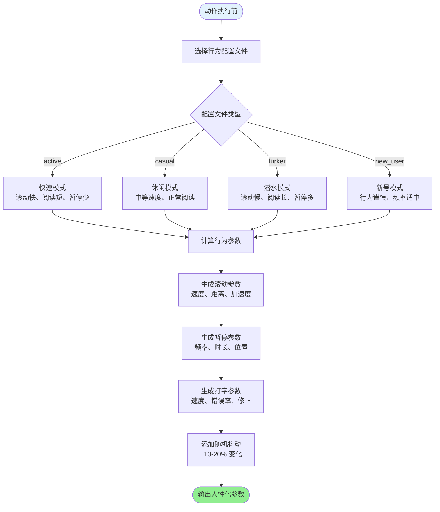
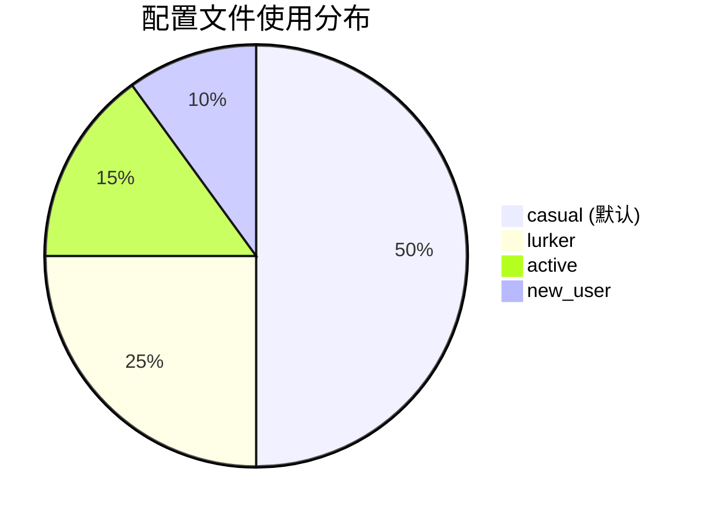
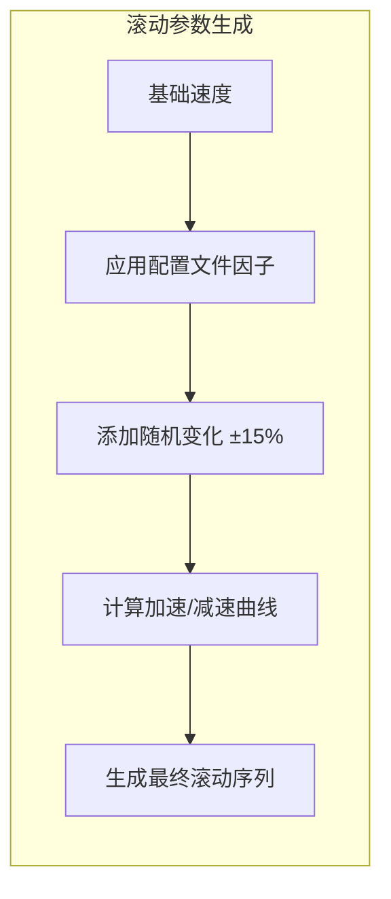
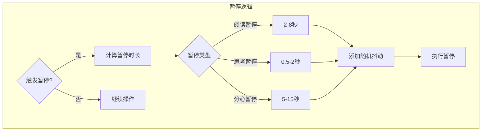
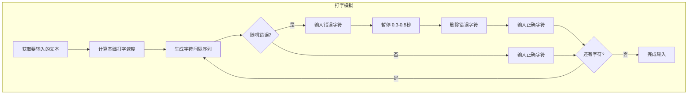

# 人性化引擎流程 (v4.5.1)

## 概述

HumanizationEngine 是 DPS v4.5 的核心模块，负责生成拟人化的行为参数，使自动化操作更接近真实用户行为，避免被平台检测。

---

## 流程图



---

## 行为配置文件详解



### 参数对比表

| 配置文件 | 滚动速度 | 阅读时间 | 暂停频率 | 打字速度 | 错误率 |
|----------|----------|----------|----------|----------|--------|
| **active** | 1.5-2.0x | 0.5-0.7x | 0.1-0.2 | 60-80 WPM | 0.05 |
| **casual** | 0.9-1.1x | 0.9-1.1x | 0.2-0.4 | 35-50 WPM | 0.10 |
| **lurker** | 0.5-0.7x | 1.5-2.0x | 0.4-0.6 | 25-40 WPM | 0.15 |
| **new_user** | 0.7-1.0x | 1.0-1.5x | 0.3-0.5 | 30-45 WPM | 0.12 |

---

## 滚动行为模拟



### 滚动参数结构

```json
{
    "scroll_speed_px_per_sec": 800,
    "scroll_distance_px": 1200,
    "acceleration_curve": "ease_in_out",
    "micro_pauses": [
        {"position": 0.3, "duration_ms": 200},
        {"position": 0.7, "duration_ms": 350}
    ],
    "jitter_factor": 0.12
}
```

---

## 暂停行为模拟



### 暂停触发条件

| 条件 | 概率 | 暂停类型 |
|------|------|----------|
| 看到感兴趣的内容 | 30-60% | 阅读暂停 |
| 准备执行下一步 | 20-40% | 思考暂停 |
| 随机分心 | 5-15% | 分心暂停 |

---

## 打字行为模拟



### 打字参数结构

```json
{
    "base_wpm": 45,
    "char_interval_ms": {
        "min": 80,
        "max": 200,
        "variance": 0.3
    },
    "error_rate": 0.12,
    "error_correction": {
        "pause_before_delete_ms": 500,
        "delete_speed_ms": 100,
        "pause_after_correct_ms": 300
    },
    "word_pause_ms": {
        "min": 100,
        "max": 400
    }
}
```

---

## 随机抖动算法

```csharp
// HumanizationEngine.cs 中的抖动算法

// 为任何数值添加随机抖动
// baseValue: 基础值
// jitterPercent: 抖动百分比 (0.1 = ±10%)
public static double AddJitter(double baseValue, double jitterPercent)
{
    Random rand = new Random();
    double jitter = baseValue * jitterPercent * (rand.NextDouble() * 2 - 1);
    return baseValue + jitter;
}

// 示例：
// AddJitter(1000, 0.15) 可能返回 850-1150 之间的值
```

---

## 配置文件选择逻辑

```csharp
// 根据画像特征选择行为配置文件

string SelectBehaviorProfile(string personaJson)
{
    // 获取画像特征
    int extraversion = int.Parse(JsonHelper.GetValue(personaJson, "personality.extraversion"));
    int conscientiousness = int.Parse(JsonHelper.GetValue(personaJson, "personality.conscientiousness"));
    string stageCode = JsonHelper.GetValue(personaJson, "stage_code");
    
    // 孕晚期/产后早期 → 更可能是 lurker
    if (stageCode == "T3" || stageCode == "PP0")
    {
        return "lurker";
    }
    
    // 高外向性 → 更可能是 active
    if (extraversion > 70)
    {
        return "active";
    }
    
    // 新账号 → new_user
    if (stageCode == "TTC")
    {
        return "new_user";
    }
    
    // 默认
    return "casual";
}
```

---

## 相关变量

| 变量名 | 说明 | 示例值 |
|--------|------|--------|
| `humanization_profile` | 当前行为配置文件 | `casual` |
| `scroll_speed_factor` | 滚动速度因子 | `1.0` |
| `read_time_factor` | 阅读时间因子 | `1.2` |
| `pause_frequency` | 暂停频率 | `0.3` |
| `typing_error_rate` | 打字错误率 | `0.12` |

---

*文档版本: v1.1 | 最后更新: 2026-02-13*
