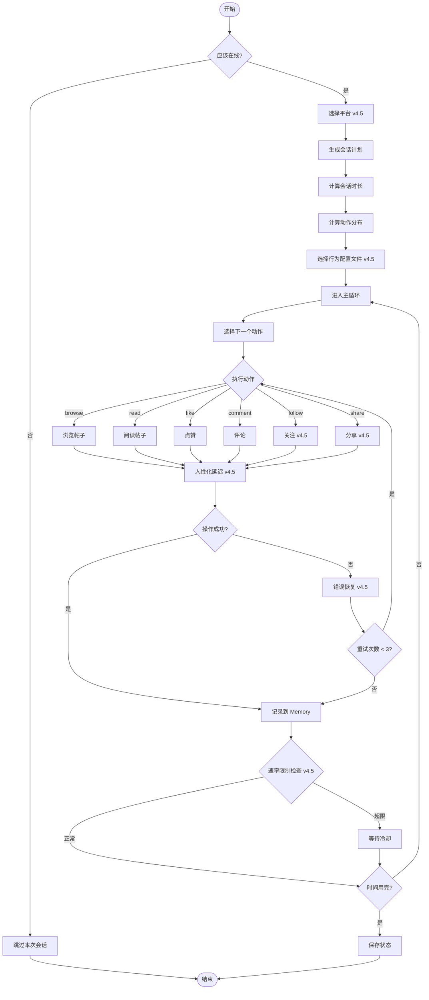
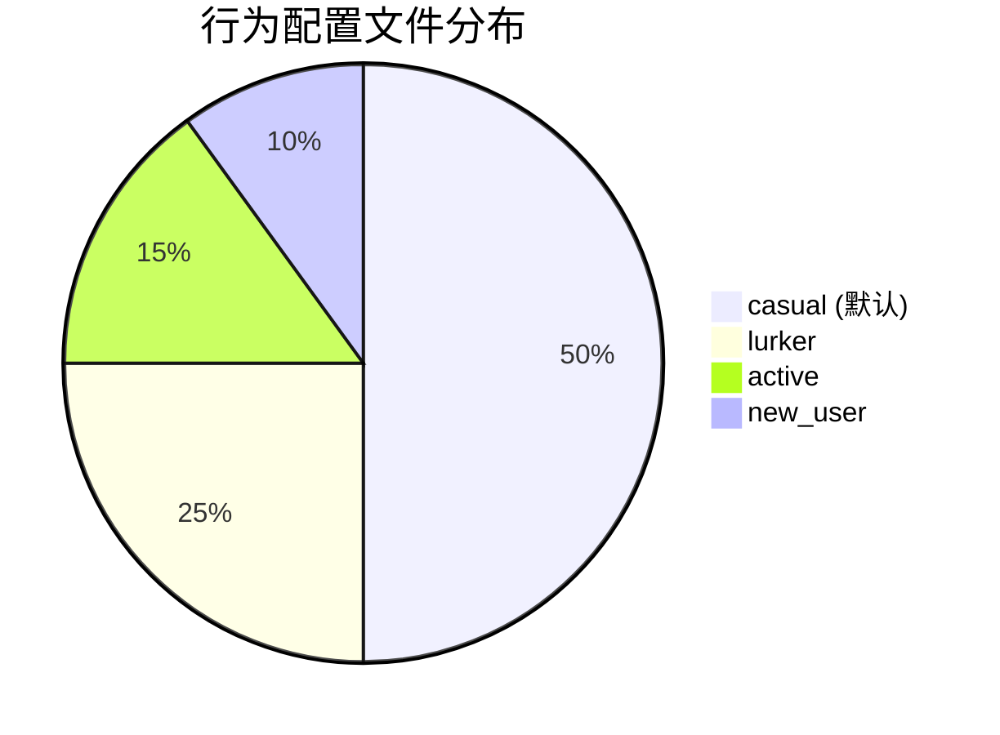
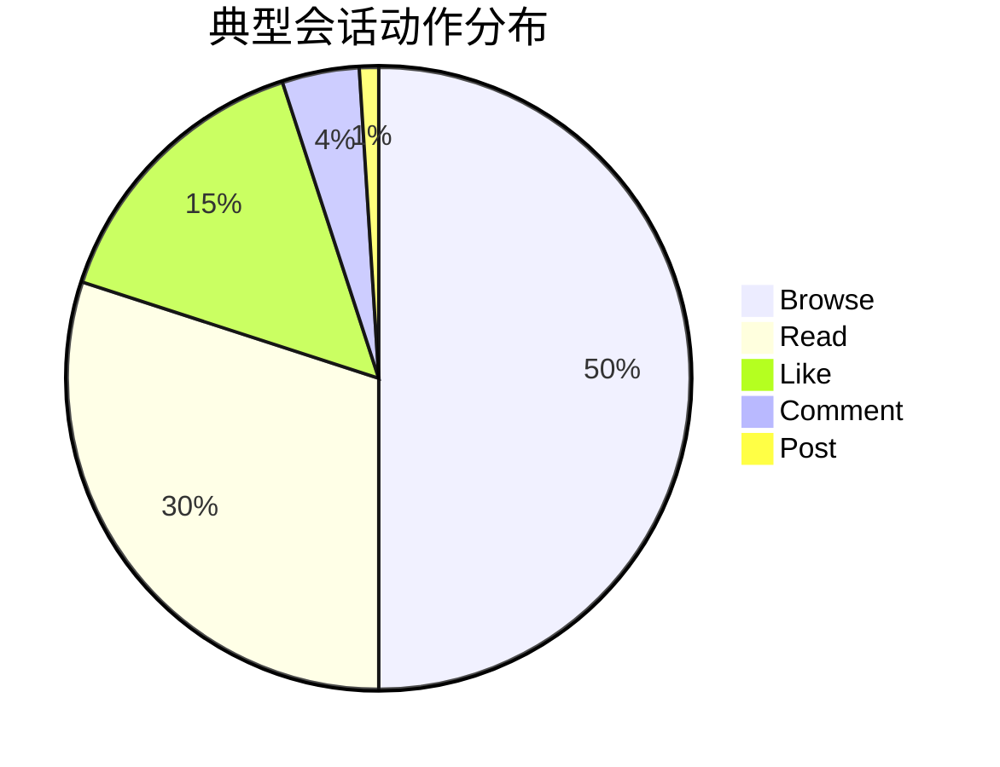

# 会话执行流程 (v4.5)

## 流程图



## v4.5 新增：行为配置文件



| 配置文件 | 滚动速度 | 阅读时间 | 暂停频率 |
|----------|----------|----------|----------|
| active | 快 | 短 | 低 |
| casual | 中 | 中 | 中 |
| lurker | 慢 | 长 | 高 |
| new_user | 中慢 | 中长 | 中高 |

## v4.5 新增：多平台支持

| 平台 | 速率限制 | 支持操作 |
|------|----------|----------|
| Reddit | 无硬限制 | browse, read, like, comment, follow, share |
| Instagram | 60/hour | browse, read, like, comment, follow, share |

## 动作权重分布



## Session Plan 结构

```json
{
  "generated_at": "2026-02-07T10:00:00",
  "platform": "reddit",
  "should_be_online": true,
  "session_duration_minutes": 15,
  "behavior_profile": "casual",
  "actions_distribution": [
    {"type": "browse", "weight": 0.50},
    {"type": "read_post", "weight": 0.30},
    {"type": "like", "weight": 0.15},
    {"type": "comment", "weight": 0.04},
    {"type": "post", "weight": 0.01}
  ],
  "behavior_parameters": {
    "typing_speed_wpm": 45,
    "error_rate": 0.12,
    "scroll_pause_ratio": 0.3
  }
}
```
