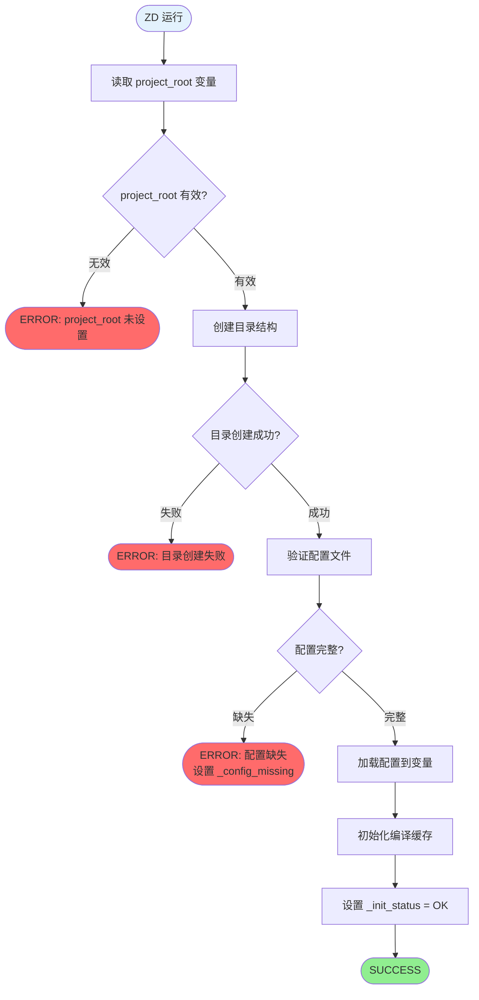
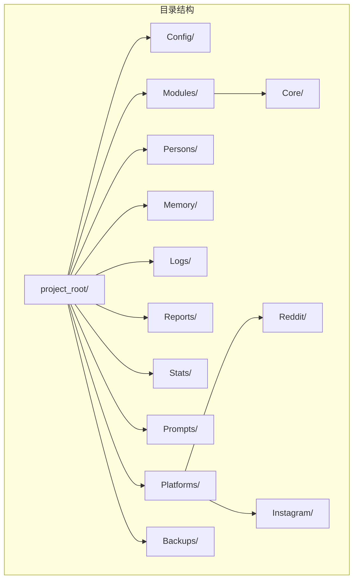
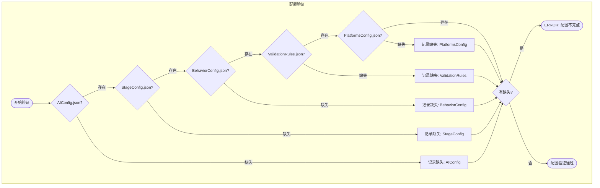
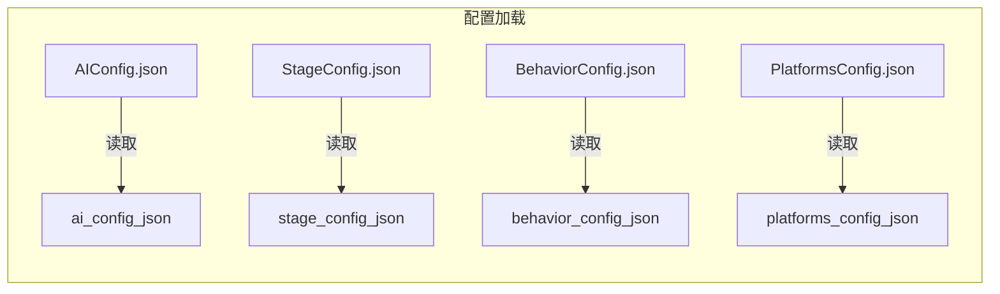
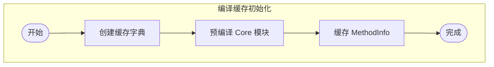

# 初始化流程 (v4.5)

## 概述

Initializer 模块是 DPS 系统启动时首先执行的模块，负责创建目录结构、验证配置文件完整性、初始化编译缓存等关键任务。

---

## 主流程图



---

## 目录结构创建



### 目录说明

| 目录 | 用途 | 创建时机 |
|------|------|----------|
| `Config/` | 配置文件 | 初始化时 |
| `Modules/` | 功能模块 | 初始化时 |
| `Modules/Core/` | 核心辅助模块 | 初始化时 |
| `Persons/` | 画像数据 | 初始化时 |
| `Memory/` | 会话记忆 | 初始化时 |
| `Logs/` | 运行日志 | 初始化时 |
| `Reports/` | 每日报告 | 初始化时 |
| `Stats/` | 运行统计 | 初始化时 |
| `Prompts/` | AI 提示词 | 初始化时 |
| `Platforms/` | 平台模块 | 初始化时 |
| `Backups/` | 备份文件 | 初始化时 |

---

## 配置文件验证



### 必需配置文件

| 文件 | 用途 | 必需 |
|------|------|------|
| `AIConfig.json` | AI 服务配置 | ✅ |
| `StageConfig.json` | 阶段参数 | ✅ |
| `BehaviorConfig.json` | 行为参数 | ✅ |
| `ValidationRules.json` | 验证规则 | ✅ |
| `PlatformsConfig.json` | 平台配置 | ✅ |
| `ExtensionsConfig.json` | 扩展配置 | ❌ 可选 |
| `MaintenanceConfig.json` | 维护配置 | ❌ 可选 |
| `EvolutionRules.json` | 进化规则 | ❌ 可选 |

---

## 配置加载到变量



---

## 编译缓存初始化



### 预编译模块列表

| 模块 | 路径 | 预编译 |
|------|------|--------|
| CoreHelper | `Modules/Core/CoreHelper.cs` | ✅ |
| JsonHelper | `Modules/Core/JsonHelper.cs` | ✅ |
| FileHelper | `Modules/Core/FileHelper.cs` | ✅ |
| AIService | `Modules/Core/AIService.cs` | ✅ |
| HumanizationEngine | `Modules/Core/HumanizationEngine.cs` | ✅ |
| UILocator | `Modules/Core/UILocator.cs` | ✅ |
| ErrorRecovery | `Modules/Core/ErrorRecovery.cs` | ✅ |

---

## 状态变量设置

| 变量名 | 成功时 | 失败时 |
|--------|--------|--------|
| `_init_status` | `OK` | `ERROR` |
| `_config_ok` | `true` | `false` |
| `_module_ok` | `true` | `false` |
| `_config_missing` | (空) | 缺失文件列表 |
| `initializer_result` | `SUCCESS` | `ERROR: {原因}` |

---

## 代码实现 (伪代码)

```csharp
// Initializer.cs

public static string Run(object projectObj)
{
    // 1. 读取 project_root
    string projectRoot = CoreHelper.GetVar("project_root");
    if (string.IsNullOrEmpty(projectRoot))
    {
        return "ERROR: project_root 未设置";
    }
    
    // 2. 创建目录结构
    string[] dirs = new string[] {
        "Config", "Modules", "Modules\\Core", "Persons",
        "Memory", "Logs", "Reports", "Stats", "Prompts",
        "Platforms", "Platforms\\Reddit", "Platforms\\Instagram",
        "Backups"
    };
    
    foreach (string dir in dirs)
    {
        string fullPath = projectRoot + dir;
        if (!System.IO.Directory.Exists(fullPath))
        {
            System.IO.Directory.CreateDirectory(fullPath);
        }
    }
    
    // 3. 验证配置文件
    string[] requiredConfigs = new string[] {
        "AIConfig.json",
        "StageConfig.json",
        "BehaviorConfig.json",
        "ValidationRules.json",
        "PlatformsConfig.json"
    };
    
    List<string> missing = new List<string>();
    foreach (string config in requiredConfigs)
    {
        string path = projectRoot + "Config\\" + config;
        if (!System.IO.File.Exists(path))
        {
            missing.Add(config);
        }
    }
    
    if (missing.Count > 0)
    {
        CoreHelper.SetVar("_config_missing", string.Join(",", missing));
        CoreHelper.SetVar("_config_ok", "false");
        return "ERROR: 配置缺失 - " + string.Join(", ", missing);
    }
    
    // 4. 加载配置到变量
    CoreHelper.SetVar("ai_config_json", 
        FileHelper.ReadFile(projectRoot + "Config\\AIConfig.json"));
    CoreHelper.SetVar("stage_config_json", 
        FileHelper.ReadFile(projectRoot + "Config\\StageConfig.json"));
    CoreHelper.SetVar("behavior_config_json", 
        FileHelper.ReadFile(projectRoot + "Config\\BehaviorConfig.json"));
    CoreHelper.SetVar("platforms_config_json", 
        FileHelper.ReadFile(projectRoot + "Config\\PlatformsConfig.json"));
    
    // 5. 设置状态
    CoreHelper.SetVar("_init_status", "OK");
    CoreHelper.SetVar("_config_ok", "true");
    CoreHelper.SetVar("_module_ok", "true");
    
    return "SUCCESS";
}
```

---

## 错误处理

| 错误 | 原因 | 解决方案 |
|------|------|----------|
| `project_root 未设置` | ZD 变量未配置 | 在 ZD 中设置 project_root 变量 |
| `目录创建失败` | 权限不足 | 检查目录权限 |
| `配置缺失` | 配置文件不存在 | 创建缺失的配置文件 |

---

*文档版本: v1.0 | 最后更新: 2026-02-07*
