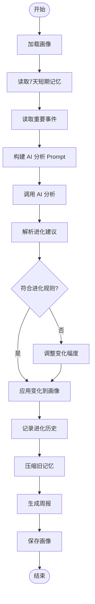
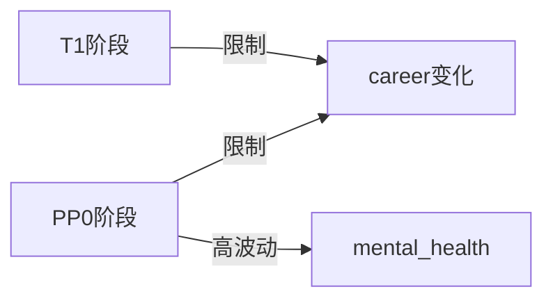

# 每周进化流程 (v4.5)

## 流程图



## 进化规则

### 字段波动性

| 波动性 | 每周最大变化 | 示例字段 |
|--------|-------------|----------|
| very_low | 0.05 | core_values, occupation |
| low | 0.1 | skills |
| moderate | 0.15 | optimism_level, hobbies |
| high | 0.2 | anxiety_prone, mental_health |

### 阶段限制



## 进化历史记录

每次进化会在 `_evolution_history` 中添加记录：

```json
{
  "date": "2025-01-27",
  "version": "1.0.1",
  "changes": [
    "personality.optimism_level: 0.7 -> 0.75",
    "health_and_wellness.mental_health.current_status: stable -> thriving"
  ],
  "trigger": "weekly_evolution",
  "ai_reasoning": "Positive interactions and support system activation"
}
```
