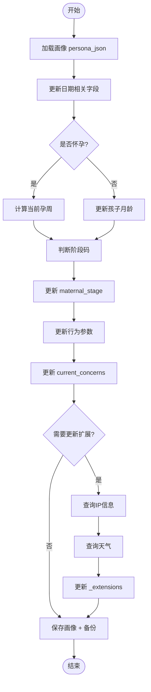
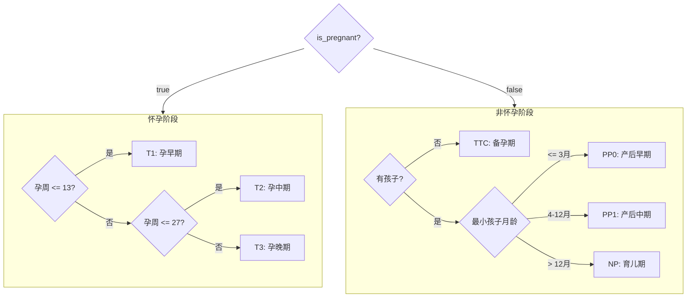

# 每日更新流程 (v4.5)

## 流程图

## 阶段判断逻辑

## 更新的字段

| 字段 | 更新内容 |
|------|----------|
| `_meta.last_updated` | 当前日期 |
| `seasonal_context.current_season` | 季节 |
| `pregnancy_status.current_week` | 孕周 |
| `children[].current_age_months` | 孩子月龄 |
| `maternal_stage.stage_code` | 阶段码 |
| `behavioral_modifiers.*` | 行为参数 |
| `current_concerns` | 当前关注点 |
| `_computed.*` | 计算字段 |
