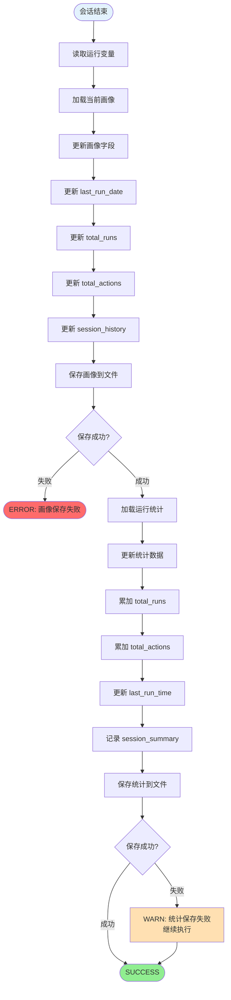
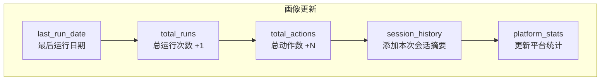
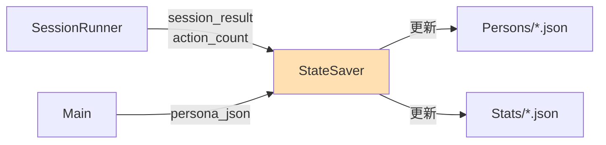

# 状态保存流程 (v4.5)

## 概述

StateSaver 模块在每次会话结束后执行，负责保存画像数据和运行统计，确保数据持久化和状态一致性。

---

## 主流程图



---

## 数据流向

```mermaid
flowchart LR
    subgraph INPUT["输入数据"]
        I1[persona_json 变量]
        I2[session_result 变量]
        I3[action_count 变量]
        I4[current_platform 变量]
    end
    
    subgraph PROCESS["StateSaver 处理"]
        P1[解析变量]
        P2[更新画像]
        P3[更新统计]
    end
    
    subgraph OUTPUT["输出文件"]
        O1[Persons/{device_id}.json]
        O2[Stats/{device_id}_stats.json]
    end
    
    I1 --> P1
    I2 --> P1
    I3 --> P1
    I4 --> P1
    
    P1 --> P2
    P1 --> P3
    
    P2 --> O1
    P3 --> O2
```

---

## 画像更新字段



### 画像更新示例

```json
// 更新前
{
    "last_run_date": "2026-02-06",
    "total_runs": 15,
    "total_actions": 450,
    "session_history": [...]
}

// 更新后
{
    "last_run_date": "2026-02-07",
    "total_runs": 16,
    "total_actions": 478,
    "session_history": [
        ...,
        {
            "date": "2026-02-07",
            "platform": "reddit",
            "actions": 28,
            "duration_min": 35,
            "result": "SUCCESS"
        }
    ]
}
```

---

## 统计文件结构

```json
// Stats/{device_id}_stats.json

{
    "device_id": "Device_001",
    "created_at": "2026-01-15T10:00:00",
    "last_updated": "2026-02-07T19:30:00",
    
    "totals": {
        "runs": 16,
        "actions": 478,
        "sessions_completed": 15,
        "sessions_failed": 1
    },
    
    "by_platform": {
        "reddit": {
            "runs": 10,
            "actions": 320,
            "browse": 150,
            "read": 80,
            "like": 50,
            "comment": 25,
            "follow": 10,
            "share": 5
        },
        "instagram": {
            "runs": 6,
            "actions": 158,
            "browse": 80,
            "read": 40,
            "like": 25,
            "comment": 10,
            "follow": 3,
            "share": 0
        }
    },
    
    "by_date": {
        "2026-02-07": {
            "runs": 1,
            "actions": 28,
            "platform": "reddit"
        },
        "2026-02-06": {
            "runs": 2,
            "actions": 55,
            "platform": "instagram"
        }
    },
    
    "recent_sessions": [
        {
            "date": "2026-02-07T19:00:00",
            "platform": "reddit",
            "actions": 28,
            "duration_min": 35,
            "result": "SUCCESS",
            "profile": "casual"
        }
    ]
}
```

---

## 原子写入机制

```mermaid
flowchart TD
    subgraph ATOMIC_WRITE["原子写入"]
        AW1[准备数据] --> AW2[写入临时文件<br/>{file}.tmp]
        AW2 --> AW3{写入成功?}
        
        AW3 -->|是| AW4[删除原文件]
        AW3 -->|否| AW_ERR[删除临时文件<br/>返回错误]
        
        AW4 --> AW5[重命名临时文件<br/>.tmp → 原文件名]
        AW5 --> AW6([完成])
    end
```

### 原子写入代码

```csharp
// FileHelper.cs 中的原子写入

public static bool AtomicWrite(string filePath, string content)
{
    string tempPath = filePath + ".tmp";
    
    try
    {
        // 1. 写入临时文件
        System.IO.File.WriteAllText(tempPath, content);
        
        // 2. 删除原文件 (如果存在)
        if (System.IO.File.Exists(filePath))
        {
            System.IO.File.Delete(filePath);
        }
        
        // 3. 重命名临时文件
        System.IO.File.Move(tempPath, filePath);
        
        return true;
    }
    catch
    {
        // 清理临时文件
        if (System.IO.File.Exists(tempPath))
        {
            System.IO.File.Delete(tempPath);
        }
        return false;
    }
}
```

---

## 状态变量

| 变量名 | 说明 | 来源 |
|--------|------|------|
| `device_id` | 设备标识 | 必填变量 |
| `persona_json` | 当前画像 | Main 模块 |
| `session_result` | 会话结果 | SessionRunner |
| `action_count` | 动作计数 | SessionRunner |
| `current_platform` | 当前平台 | SessionRunner |

---

## 错误处理

| 错误 | 原因 | 处理方式 |
|------|------|----------|
| 画像保存失败 | 磁盘空间/权限 | 返回 ERROR，停止执行 |
| 统计保存失败 | 磁盘空间/权限 | 记录 WARN，继续执行 |
| JSON 解析失败 | 数据损坏 | 使用备份恢复 |

---

## 与其他模块的关系



---

*文档版本: v1.0 | 最后更新: 2026-02-07*
