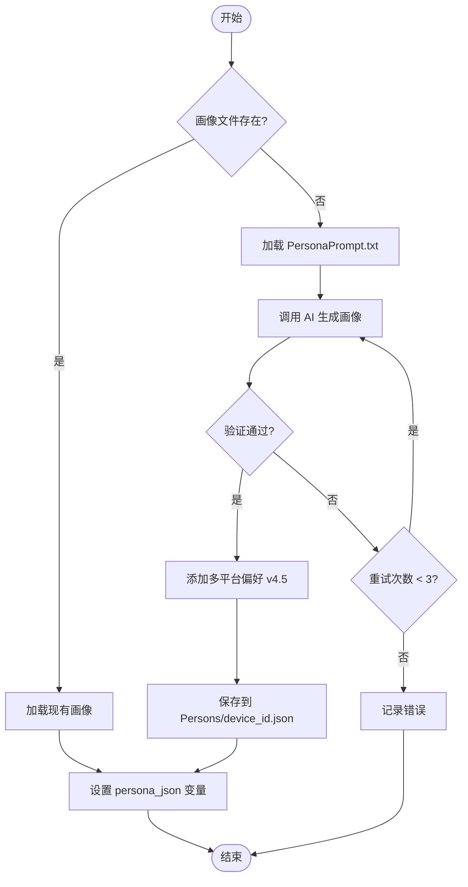

# 画像生成流程 (v4.5)

## 流程图



## 步骤说明

### 1. 检查画像文件
```
路径: Persons/{device_id}.json
如果存在则加载，否则生成新画像
```

### 2. 加载母模板
```
路径: Config/PersonaPrompt.txt
版本: v2.8
```

### 3. AI 生成
```
模型: Gemini (主) → OpenAI (备)
超时: 120秒
重试: 最多3次
```

### 4. 验证规则
```
- _meta.persona_id 格式正确
- basic_info.name 非空
- maternal_stage.stage_code 有效
- 逻辑一致性检查
```

### 5. v4.5 新增：多平台偏好
```json
{
  "platform_preferences": {
    "reddit": {
      "preferred_subreddits": ["BabyBumps", "pregnant"],
      "interaction_style": "supportive",
      "posting_frequency": "moderate"
    },
    "instagram": {
      "preferred_hashtags": ["pregnancy", "momlife"],
      "interaction_style": "visual",
      "posting_frequency": "low"
    }
  }
}
```

### 6. 保存
```
使用原子写入 (先写临时文件再替换)
创建每日备份
```
