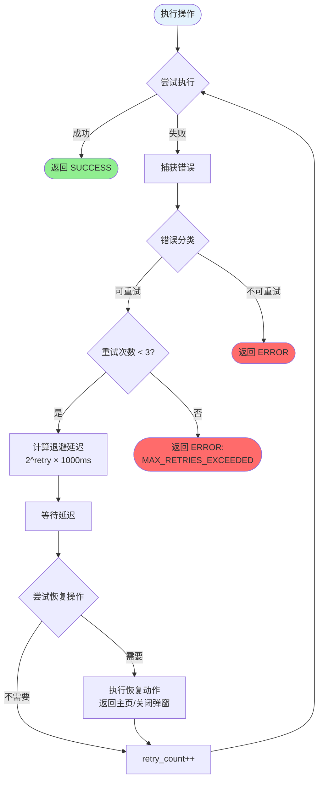
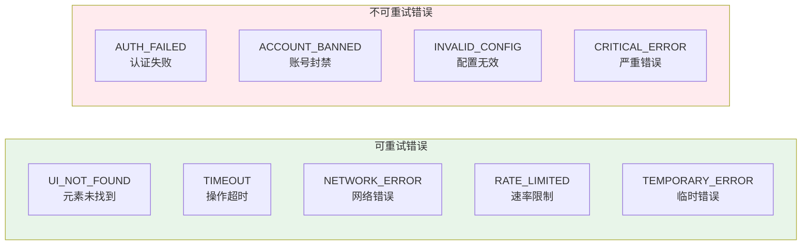
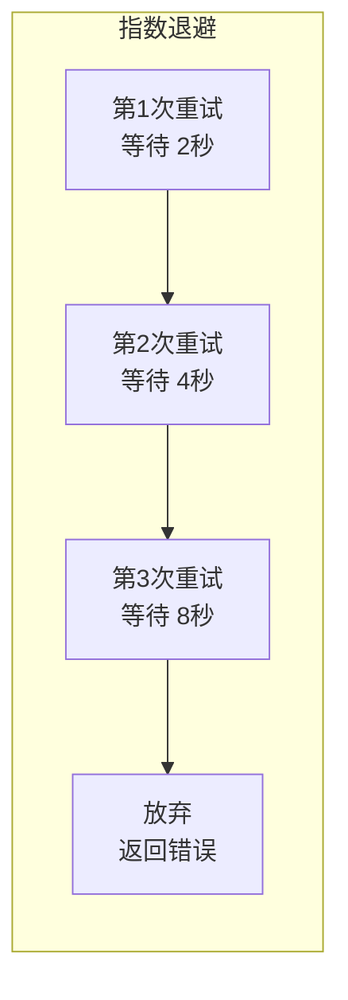
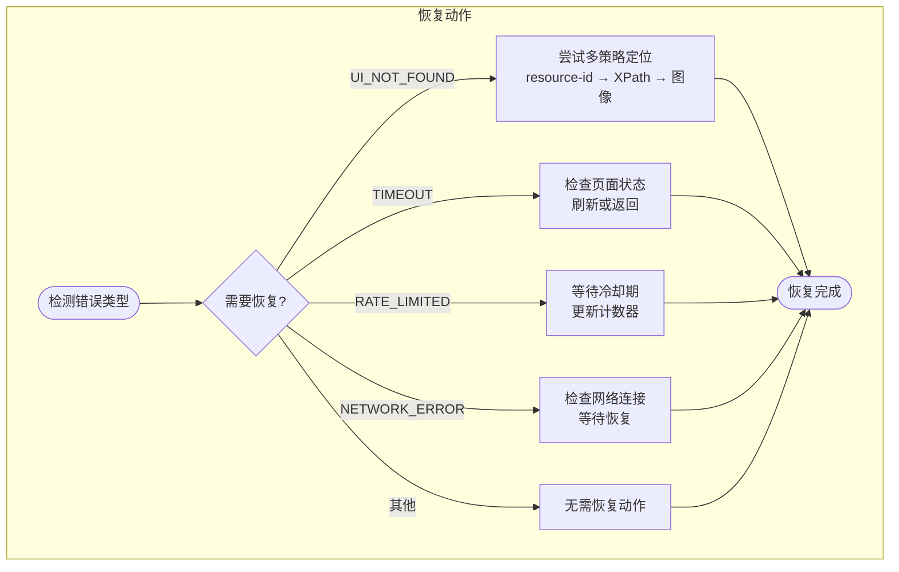
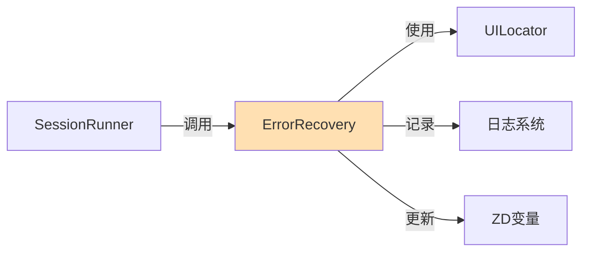

# 错误恢复流程 (v4.5)

## 概述

ErrorRecovery 模块提供自动错误处理和重试机制，使用指数退避策略（2s → 4s → 8s），最多重试 3 次，确保操作的稳定性和可靠性。

---

## 主流程图



---

## 错误分类



### 错误类型详解

| 错误类型 | 说明 | 可重试 | 恢复动作 |
|----------|------|--------|----------|
| `UI_NOT_FOUND` | UI 元素未找到 | ✅ | 刷新页面/返回主页 |
| `TIMEOUT` | 操作超时 | ✅ | 等待后重试 |
| `NETWORK_ERROR` | 网络连接问题 | ✅ | 检查网络后重试 |
| `RATE_LIMITED` | 平台速率限制 | ✅ | 等待冷却期 |
| `TEMPORARY_ERROR` | 临时性错误 | ✅ | 直接重试 |
| `AUTH_FAILED` | 登录/认证失败 | ❌ | 停止执行 |
| `ACCOUNT_BANNED` | 账号被封禁 | ❌ | 停止执行 |
| `INVALID_CONFIG` | 配置文件错误 | ❌ | 停止执行 |
| `CRITICAL_ERROR` | 严重系统错误 | ❌ | 停止执行 |

---

## 指数退避策略



### 退避计算公式

```
delay_ms = base_delay × 2^(retry_count)

其中:
- base_delay = 1000ms (1秒)
- retry_count = 1, 2, 3

结果:
- 第1次: 1000 × 2^1 = 2000ms (2秒)
- 第2次: 1000 × 2^2 = 4000ms (4秒)
- 第3次: 1000 × 2^3 = 8000ms (8秒)
```

---

## 恢复动作流程



---

## 代码实现 (伪代码)

```csharp
// ErrorRecovery.cs

public static string ExecuteWithRetry(
    Func<string> action,
    int maxRetries = 3,
    int baseDelayMs = 1000)
{
    int retryCount = 0;
    string lastError = "";
    
    while (retryCount <= maxRetries)
    {
        try
        {
            // 尝试执行操作
            string result = action();
            
            if (result.StartsWith("SUCCESS"))
            {
                return result;
            }
            
            // 检查是否可重试
            if (!IsRetryableError(result))
            {
                return result; // 不可重试，直接返回
            }
            
            lastError = result;
        }
        catch (Exception ex)
        {
            lastError = "ERROR: " + ex.Message;
            
            if (!IsRetryableException(ex))
            {
                return lastError;
            }
        }
        
        // 已达最大重试次数
        if (retryCount >= maxRetries)
        {
            break;
        }
        
        // 计算退避延迟
        int delayMs = baseDelayMs * (int)Math.Pow(2, retryCount + 1);
        
        // 设置变量供外部监控
        CoreHelper.SetVar("retry_count", retryCount.ToString());
        CoreHelper.SetVar("retry_delay_ms", delayMs.ToString());
        
        // 等待
        System.Threading.Thread.Sleep(delayMs);
        
        // 尝试恢复
        TryRecovery(lastError);
        
        retryCount++;
    }
    
    return "ERROR: MAX_RETRIES_EXCEEDED - " + lastError;
}

private static bool IsRetryableError(string error)
{
    string[] retryable = new string[] {
        "UI_NOT_FOUND",
        "TIMEOUT",
        "NETWORK_ERROR",
        "RATE_LIMITED",
        "TEMPORARY_ERROR"
    };
    
    foreach (string e in retryable)
    {
        if (error.Contains(e)) return true;
    }
    return false;
}

private static void TryRecovery(string error)
{
    if (error.Contains("UI_NOT_FOUND"))
    {
        // 尝试返回主页
        // UILocator.NavigateToHome();
    }
    else if (error.Contains("RATE_LIMITED"))
    {
        // 等待额外时间
        System.Threading.Thread.Sleep(5000);
    }
    // ... 其他恢复逻辑
}
```

---

## 状态变量

| 变量名 | 说明 | 示例值 |
|--------|------|--------|
| `retry_count` | 当前重试次数 | `0`, `1`, `2` |
| `max_retries` | 最大重试次数 | `3` |
| `retry_delay_ms` | 当前退避延迟 | `2000`, `4000`, `8000` |
| `last_error_type` | 最后错误类型 | `UI_NOT_FOUND` |
| `last_error` | 最后错误详情 | `Element not found: like_button` |

---

## 日志输出示例

```
[INFO] 执行操作: Like
[WARN] 操作失败: UI_NOT_FOUND - like_button
[INFO] 重试 1/3，等待 2000ms
[INFO] 执行恢复动作: 刷新页面
[INFO] 重试执行操作: Like
[INFO] 操作成功
```

```
[INFO] 执行操作: Comment
[WARN] 操作失败: TIMEOUT
[INFO] 重试 1/3，等待 2000ms
[WARN] 操作失败: TIMEOUT
[INFO] 重试 2/3，等待 4000ms
[WARN] 操作失败: TIMEOUT
[INFO] 重试 3/3，等待 8000ms
[ERROR] 操作失败: MAX_RETRIES_EXCEEDED - TIMEOUT
```

---

## 与其他模块的集成



---

*文档版本: v1.0 | 最后更新: 2026-02-07*
